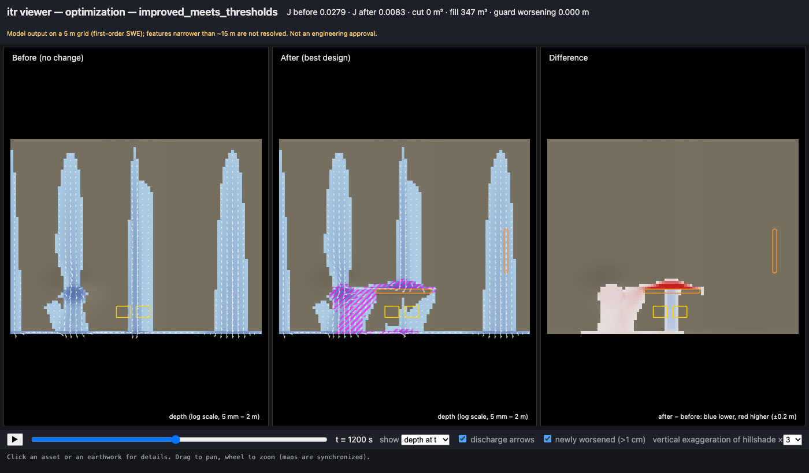
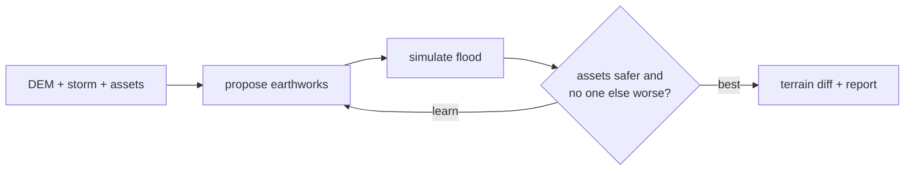

# Inverse Terrain Engine (`itr`)

Search for small earthworks (berms, swales, cuts, mounds) that reduce flood depth at protected assets **without moving the flood onto someone else**, using a fast 2D shallow-water solver as the forward model.



*`diverted-flood` example: the optimized berm (horizontal orange outline) turns the flow away from the houses (yellow boxes). J drops from 0.0279 to 0.0083, and no guard cell gets worse.*



- Design and research plan: [`spec.md`](spec.md). Implementation status, deviations and measured numbers are in Appendix B.
- A single static binary, pure Rust: no GDAL, Python, or C toolchain.
- Deterministic: optimizer traces are bitwise identical across thread counts and across kill/`--resume`.

## Quick start

```bash
cargo build --release
./target/release/itr synth examples                   # write three example scenarios
./target/release/itr validate                         # analytic/reference solver tests (f64 + f32)
./target/release/itr simulate --scenario examples/synthetic-valley/scenario.toml --out runs/base
./target/release/itr optimize --scenario examples/synthetic-valley/scenario.toml --out runs/opt
./target/release/itr view runs/opt                    # open runs/opt/index.html (works from file://)
./target/release/itr optimize --resume runs/opt       # exact resume after an interruption
./target/release/itr export --run runs/opt --format landxml   # or dxf, geotiff, geojson, csv
```

GPU backend (wgpu: Metal, Vulkan, DX12), optional:

```bash
cargo build --release -p itr-cli --features gpu
./target/release/itr bench --backend gpu
./target/release/itr optimize --scenario examples/diverted-flood/scenario.toml --out runs/gpu --backend gpu
```

External optimizers (BoTorch, Optuna, Nevergrad, …) can drive the evaluator via `itr serve-eval` (JSON lines; see [`docs/schema.md`](docs/schema.md)).

Exit codes:

| Code | Meaning |
|---|---|
| 0 | OK |
| 1 | Error |
| 2 | Infeasible problem: no feasible design beats no-change. This is a valid result |
| 3 | Validation failure |

## Workspace

| Crate | Role |
|---|---|
| `itr-core` | Grid and raster conventions, scenario schema, design space, objective, model contracts. No I/O |
| `itr-hydro` | Shallow-water solver: `f32`/`f64` scalar oracle and fused in-place kernel, local-inertial screening kernel, persistent grid-parallel workers, sync points, ledger, warm start, baseline-locked Δt, subdomain replay, validation cases |
| `itr-opt` | Pinned RNG, CMA-ES / lq-CMA-ES, Sobol, random and compass search, flow corridors, evaluator (early abort, cache, robust ensembles, batch backend), multi-fidelity driver, ablation |
| `itr-gpu` | Optional wgpu/WGSL solver for batched `f32` candidates (not a default member) |
| `itr-cli` | The `itr` binary: GeoTIFF/GeoJSON I/O, commands, result files, viewer bundle |
| `viewer/` | Static WebGL2 viewer, embedded into the binary |

## Inputs

- A **projected, metric** single-band GeoTIFF DEM. Supported compression: none, LZW, or Deflate. Reproject first if needed: `gdalwarp -t_srs EPSG:<utm> in.tif out.tif`.
- GeoJSON polygons in the DEM's CRS for:
  - the editable area;
  - protected assets (properties `name`, `threshold_m`, `weight`);
  - downstream guard areas;
  - obstacles.
- A primitives file and a scenario. See [`docs/schema.md`](docs/schema.md).

## Outputs (`itr optimize --out D`)

| File | Contents |
|---|---|
| `manifest.json` | Inputs and their hashes, versions, `z_ref`, precision, determinism, limitations |
| `terrain_{before,after,delta}.tif`, `peak_depth_{before,after}.tif`, `delta_peak_depth.tif`, `time_to_peak_*.tif` | Rasters |
| `earthworks.geojson` | Each primitive with its dimensions and normalized θ |
| `metrics.json` | Outcome, baseline and candidate objective, Pareto front, budget, robust members, ablation summary |
| `ablation.json` | J of every subset of the final design's primitives, Shapley attribution, redundant primitives |
| `mass_balance*.csv` | Mass balance per sync interval |
| `search.jsonl`, `cache.jsonl`, `optimizer_state.json`, `run.json` | Search trace and resume state |
| `frames/` | Viewer data |

## Limitations

See [`docs/limitations.md`](docs/limitations.md). Results are model outputs on the supplied DEM, not engineering design approval.

## License

Apache-2.0 OR MIT.
