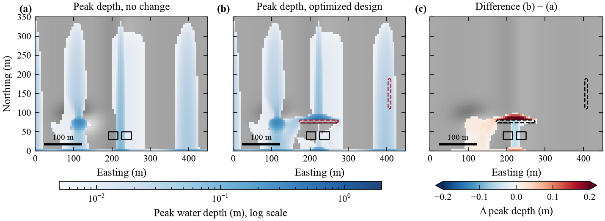
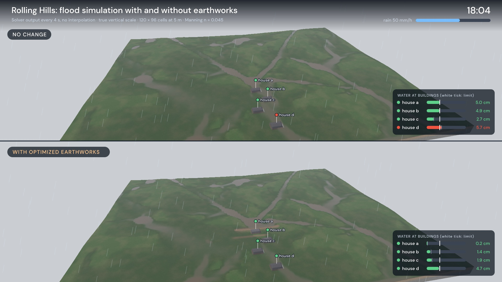
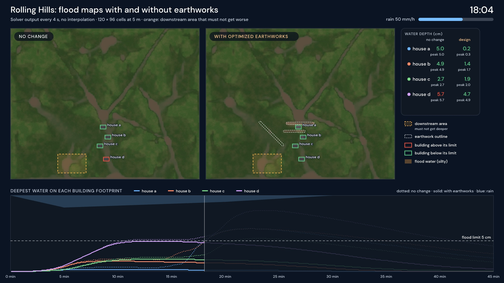
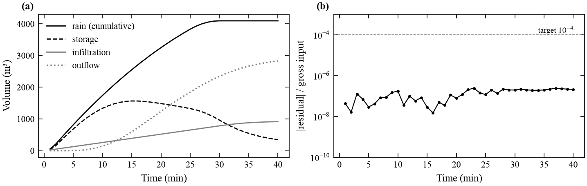
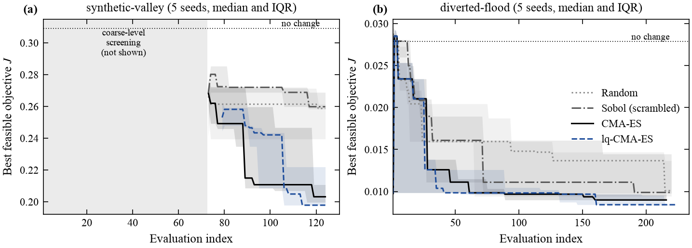
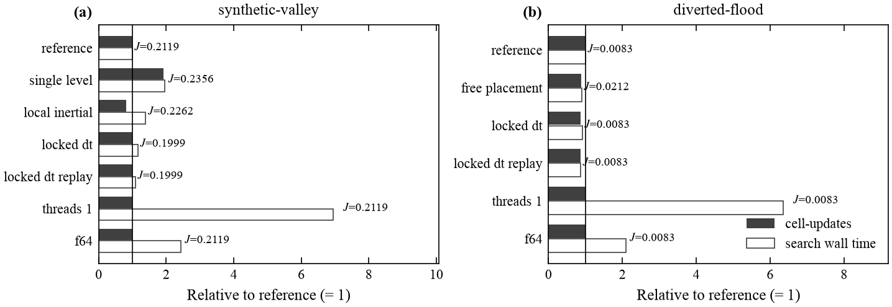
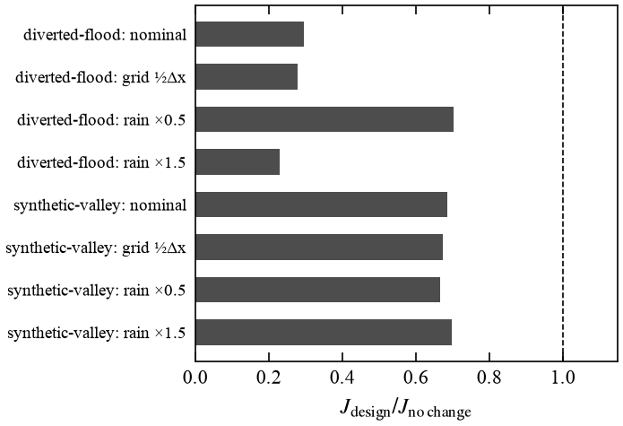
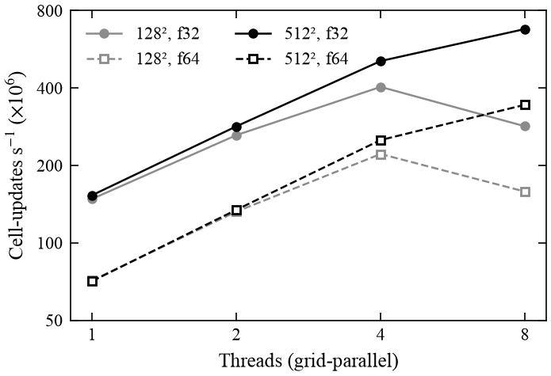

# Inverse Terrain Engine (`itr`)

**Constrained search for small flood-mitigation earthworks, using a deterministic 2D shallow-water model as the forward operator**

Technical specification: [`spec.md`](spec.md) (v0.6) · Numerical method: [`docs/numerical-method.md`](docs/numerical-method.md) · Validation: [`docs/validation.md`](docs/validation.md) · Limitations: [`docs/limitations.md`](docs/limitations.md)

---

## Abstract

`itr` searches for small earthworks (berms, swales, cuts and mounds, at most a few hundred m³) that lower peak flood depth at protected assets **without moving the flood onto designated downstream areas**. Each candidate design is scored with a first-order finite-volume shallow-water model: HLL fluxes, hydrostatic reconstruction and point-implicit Manning friction. Downstream harm is a hard constraint, enforced by exact early abort. The search methods are CMA-ES (optionally with a surrogate), random search and scrambled Sobol sampling. Placements can be restricted to flow corridors traced on the baseline discharge field. On the bundled synthetic scenarios the best design lowers the objective by 30–70% against no change. The design still lowers it on a grid with half the cell size and with rainfall halved or increased by half. All CPU results are bitwise reproducible across thread counts and across interruption and resume. The engine is a single pure-Rust binary of about 1.7 MB.

<p align="center"></p>

**Figure 1.** `diverted-flood` example (90 × 70 cells at 5 m, 40 min design storm). (a) Peak water depth with no change. (b) Peak depth with the optimized design: one 94 m berm (dashed red; the swale on the right is redundant, see §4). (c) Difference (b) − (a). Protected assets are the black rectangles. Their peak depths fall from 0.033 and 0.062 m to 0.005 and 0.012 m, below the 0.05 m threshold. Water ponds upstream of the berm (red in c; 7100 m² worsened by more than 1 cm). That area is outside the guard zones, whose maximum worsening is 0.000 m.

**Simulation videos.** The same runs animated over the storm, with no change (top or left) beside the optimized design (bottom or right). The frames are rendered on the GPU from one solver state per video frame, every 4 s of simulated time, with no interpolation. The 3D view ray-marches the terrain and water at true vertical scale, shading turbid water by its depth and wetting the ground under the rain of the hyetograph. The videos are not committed; §5 shows how to render them.

<p align="center"></p>
<p align="center"></p>

**Video frames** at 18 min of the `rolling-hills` videos: hills and gullies above four houses, 120 × 96 cells at 5 m (written by `scripts/make_rolling_hills.py`, not `itr synth`). With no change house d floods above its 5 cm limit. The optimized design (two berms and a swale, 293 m³) keeps all four houses below the limit and raises the downstream area (orange) by at most 1 mm, within its 1 cm tolerance; J falls by 78%.

## 1. Problem statement

Given a projected DEM $z(x,y)$, a rainfall hyetograph and boundary conditions, protected footprints $A_k$ with depth thresholds $\eta_k$, and guard areas $G$:

$$
\min_{\theta \in \Theta} \; J(\theta) = \sum_k w_k\,\mathrm{softplus}_\tau\!\big(\max_{t,\,x\in A_k} h_\theta(x,t) - \eta_k\big) + \lambda\,C_\mathrm{earth}(\theta)
$$

$$
\text{s.t.}\quad \max_{t} h_\theta(x,t) - \max_t h_0(x,t) \le \varepsilon_G \;\; \forall x \in G, \qquad |\Delta z_\theta| \le \Delta z_\mathrm{max}, \qquad V_\mathrm{cut}+V_\mathrm{fill} \le V_\mathrm{max}.
$$

Here $h_\theta$ solves the 2D shallow-water equations on the edited terrain $z + \Delta z_\theta$. $\theta$ parameterizes a fixed number of compact-support primitives, each with a position, length, width, angle and height, quantized to the grid. "No change" ($\theta$ with zero heights) is always a candidate. If no feasible design beats it, the result is *infeasible* (exit code 2), not a fabricated improvement.

## 2. Method

```text
DEM + storm + assets ─▶ propose earthworks ─▶ simulate flood ─▶ score ─▶ best design ─▶ revalidate ─▶ report
                              ▲                                   │
                              └────────────── learn ──────────────┘
```

| Component | Choice | Reference |
|---|---|---|
| Physics | 2D shallow-water equations, first order: HLL flux, hydrostatic reconstruction (depth-only, well balanced), point-implicit Manning friction, exact hyetograph integral, constant-capacity infiltration | spec §5 |
| Precision | `f64` scalar oracle; `f32` fused kernel for search (`f64` ledgers) | §7.3 |
| Determinism | No FMA or platform libm on the result path; fixed 16-accumulator sums; pinned ChaCha8 RNG | §7.9 |
| Search | CMA-ES (IPOP restarts), lq-CMA-ES surrogate, random, scrambled Sobol, compass | §6.4 |
| Exact work avoidance | Dry-row skipping, checkpoint warm start, guard and incumbent early abort, content-addressed cache | §7.6 |
| Fidelity ladder | Face-crest coarse grids; optional local-inertial screening physics | §7.7, §19.1 |
| Design space | Free placement, or placement along baseline flow corridors | §7.11.4 |
| Final checks | Bitwise rerun, Shapley ablation of primitives, revalidation on a finer grid and alternate storms | §9.2 |

## 3. Verification

All 16 analytic and reference cases pass in both precisions (`itr validate --precision both`).

**Table 1.** Solver verification. Thresholds are in [`docs/validation.md`](docs/validation.md).

| Case | Metric | `f64` | `f32` |
|---|---|---:|---:|
| Lake at rest, variable bed with step | max \|Δη\| + \|q\| | 2.6 × 10⁻¹⁴ | 1.6 × 10⁻⁵ |
| Rain on a closed plain | relative mass residual | 8.9 × 10⁻¹⁶ | 1.6 × 10⁻⁷ |
| Ritter dam break (dry bed) | relative L1 depth error | 5.6 × 10⁻³ | 5.6 × 10⁻³ |
| Wetting/drying over a step | relative mass residual | 0 | 0 |
| Tilted plane, kinematic limit | \|Q_out / Q_rain − 1\| | 1.2 × 10⁻¹⁴ | 3.6 × 10⁻⁶ |
| Gauge invariance (+1000 m) | cells differing | 0 | 0 |
| Walls under rain | relative mass residual | 5.0 × 10⁻¹⁶ | 9.7 × 10⁻⁸ |
| Inflow boundary ledger | relative mass residual | 1.5 × 10⁻¹⁵ | 3.2 × 10⁻⁷ |

`cargo test --release` adds the implementation-equivalence tests. The fused kernel matches the oracle bitwise. Results are identical across 1–7 threads, with skipping on or off, and with warm or cold start. Steady state makes zero heap allocations. Property tests cover random terrains, rain and edits.

<p align="center"></p>

**Figure 2.** Water ledger of the `diverted-flood` no-change run (`f32`). (a) Cumulative rain, storage, infiltration and outflow. (b) Ledger residual per sync interval, relative to gross input. It stays below 3 × 10⁻⁷, against a project target of 10⁻⁴.

## 4. Results

### 4.1 Optimizer comparison at equal budget

<p align="center"></p>

**Figure 3.** Best feasible objective against evaluation index: median (line) and interquartile range (band) over 5 seeds. (a) `synthetic-valley` (100 × 80 cells, levels [2, 1], 124 simulations). Coarse-level values are not comparable with the full-resolution J and are omitted. (b) `diverted-flood` (corridor placement, 200 simulations).

**Table 2.** Best feasible J at the end of the budget, as median [min, max] over 5 seeds. With 5 seeds the differences between methods are indicative only; no significance test was run.

| Method | `synthetic-valley` (no change 0.309) | `diverted-flood` (no change 0.0279) |
|---|---:|---:|
| Random | 0.259 [0.226, 0.276] | 0.0101 [0.0082, 0.0169] |
| Sobol (scrambled) | 0.260 [0.213, 0.272] | 0.0099 [0.0090, 0.0199] |
| CMA-ES | 0.203 [0.198, 0.247] | 0.0090 [0.0088, 0.0098] |
| lq-CMA-ES | **0.198** [0.191, 0.230] | **0.0084** [0.0081, 0.0180] |

### 4.2 Contribution of each acceleration lever

<p align="center"></p>

**Figure 4.** One lever changed at a time, relative to each example's shipped configuration: total cell-updates (filled), search wall time (open) and the best J reached at the same simulation budget. Host: Apple M4 Pro (8P + 4E cores), load average 2–8. Data: [`docs/data/levers.json`](docs/data/levers.json).

Observations:

- **Candidate parallelism** gives the largest factor: one worker is 6.4–6.9× slower than 12.
- **Multi-fidelity** (levels [2, 1] vs [1]) halves the cell-updates on `synthetic-valley` and also reaches a better J (0.212 vs 0.236).
- **Corridor placement** reaches J = 0.0083 instead of 0.0212 at the same budget on `diverted-flood`. The parameterization mattered more than the optimizer.
- **Baseline-locked Δt** saves 13% of cell-updates on `diverted-flood` and gives the same result.
- **Subdomain replay** did not engage on either example. The region of interest (editable, asset and guard areas plus the travel margin) covers more than half the domain, and the engine then falls back to the full domain by design.
- **Local-inertial screening** cut cell-updates by 19%, but wall time did not improve under the measured load, and the search ended at a slightly worse J.

### 4.3 Robustness of the final design

<p align="center"> </p>

**Figure 5.** Left: $J_\mathrm{design}/J_\mathrm{no\,change}$ at nominal conditions and in the three revalidation cases (grid with half the cell size; rainfall × 0.5 and × 1.5). No reversals: every case stays feasible and below 1. Right: single-simulation throughput of the fused kernel against grid-parallel threads (`itr bench`). The 128² grid stops scaling beyond 4 threads, because synchronization dominates a 16k-cell step.

## 5. Reproducing the results

Requires a Rust toolchain (pinned in `rust-toolchain.toml`). The figures additionally need Python with `numpy`, `matplotlib` and `tifffile`; the engine itself never does.

```bash
cargo build --release
./target/release/itr validate --precision both                      # Table 1
./target/release/itr optimize --scenario examples/diverted-flood/scenario.toml   --out runs/readme/diverted-flood
./target/release/itr optimize --scenario examples/synthetic-valley/scenario.toml --out runs/readme/synthetic-valley
python3 scripts/lever_study.py --seeds 5                            # Table 2, Figures 3 and 4 (~15 min)
for t in 2 4 8; do ./target/release/itr bench --threads $t --json; done   # Figure 5 (right); merged into docs/data/bench.json
uv run --with numpy --with matplotlib --with tifffile scripts/figures.py
./target/release/itr view runs/readme/diverted-flood                # interactive viewer, opens from file://
# Simulation videos: re-simulate each design at the video frame rate, then render with fframes (GPU, Metal)
uv run --with numpy --with tifffile scripts/make_rolling_hills.py
./target/release/itr optimize --scenario examples/rolling-hills/scenario.toml    --out runs/readme/rolling-hills
uv run --with numpy --with scipy --with tifffile --with lz4 scripts/video_data.py --example rolling-hills
cd video
cargo run --release -- render --data ../runs/video/rolling-hills -o ../docs/video/rolling-hills-3d.mp4
cargo run --release -- render --data ../runs/video/rolling-hills --layout 2d -o ../docs/video/rolling-hills.mp4
cargo run --release -- preview --data ../runs/video/rolling-hills   # real-time window
```

Search traces are bitwise identical across thread counts and across kill and `--resume`. Wall times depend on the host and its load; the JSON files record both.

<p align="center"></p>

**Figure 6.** The static viewer written by `itr view`. It shows synchronized before, after and difference maps with a time scrubber, discharge arrows, newly worsened cells hatched, point inspection, and asset and earthwork tables. It is WebGL2 with no framework, and works from `file://`.

## 6. Usage

```bash
itr synth examples                                   # write the three example scenarios
itr inspect dem.tif                                  # CRS, extent, nodata, z range, memory estimate
itr simulate --scenario s.toml --out runs/base
itr optimize --scenario s.toml --out runs/opt [--method cma_es|lq_cma_es|random|sobol|coordinate] [--max-sims N] [--no-revalidate]
itr optimize --resume runs/opt                       # exact resume
itr compare  --baseline runs/base --candidate runs/opt
itr export   --run runs/opt --format geotiff|geojson|csv|landxml|dxf
itr serve-eval --scenario s.toml                     # ask/tell JSON lines for BoTorch, Optuna, Nevergrad, ...
```

Optional GPU backend (wgpu: Metal, Vulkan, DX12): `cargo build --release -p itr-cli --features gpu`, then `--backend gpu`.

Exit codes: 0 OK · 1 error · 2 infeasible problem (a valid result) · 3 validation failure.

**Inputs.**
- A projected, metric, single-band GeoTIFF DEM (uncompressed, LZW or Deflate). Reproject first with `gdalwarp -t_srs EPSG:<utm>`.
- GeoJSON polygons in the DEM's CRS for the editable area, protected assets (properties `name`, `threshold_m`, `weight`), guard areas and obstacles.
- A primitives file and a TOML scenario. See [`docs/schema.md`](docs/schema.md).

**Outputs** of `itr optimize --out D`:

| File | Contents |
|---|---|
| `manifest.json` | Input hashes (BLAKE3), versions, `z_ref`, precision, determinism level, limitations |
| `terrain_*.tif`, `peak_depth_*.tif`, `delta_peak_depth.tif`, `time_to_peak_*.tif` | Float32 GeoTIFF rasters |
| `earthworks.geojson` | Each primitive with its dimensions and normalized θ |
| `metrics.json` | Outcome, baseline and candidate objective, Pareto front, budget, ablation and revalidation summaries |
| `ablation.json` | J of every subset of the design's primitives; Shapley attribution |
| `revalidation.json` | Finer-grid and alternate-rainfall cases; reversals |
| `mass_balance*.csv` | Water ledger per sync interval |
| `search.jsonl`, `cache.jsonl`, `optimizer_state.json`, `run.json` | Search trace and resume state |

## 7. Code organization

| Crate | Role |
|---|---|
| `itr-core` | Grid and raster conventions, scenario schema, design space, objective. No I/O |
| `itr-hydro` | Shallow-water solver: `f32`/`f64` oracle and fused kernel, local-inertial kernel, persistent workers, ledger, warm start, locked Δt, subdomain replay, validation cases |
| `itr-opt` | RNG, CMA-ES / lq-CMA-ES, Sobol, random and compass search, flow corridors, evaluator, multi-fidelity driver, ablation |
| `itr-gpu` | Optional wgpu/WGSL solver for batched `f32` candidates |
| `itr-cli` | The `itr` binary: GeoTIFF/GeoJSON I/O, commands, result files, revalidation, viewer bundle |
| `viewer/` | Static WebGL2 viewer, embedded in the binary |
| `scripts/` | Lever study, figures, the `rolling-hills` example and video data (Python; not used by the engine) |
| `video/` | GPU video renderer (fframes and SkSL; separate Cargo workspace) |

## 8. Limitations

The examples are synthetic, and no result here has been checked against an observed flood. The model is first order, with no culverts, subgrid obstructions or drainage network. Rainfall is spatially uniform and infiltration has constant capacity. Results are model outputs on the supplied DEM, **not an engineering design approval**. See [`docs/limitations.md`](docs/limitations.md).

## Citation

```bibtex
@software{itr2026,
  title  = {Inverse Terrain Engine: constrained search for flood-mitigation earthworks with a deterministic shallow-water model},
  year   = {2026},
  url    = {https://github.com/Lulzx/inverse-terrain-engine},
  note   = {Version 0.1.0; specification v0.6}
}
```

## License

Apache-2.0 OR MIT.
