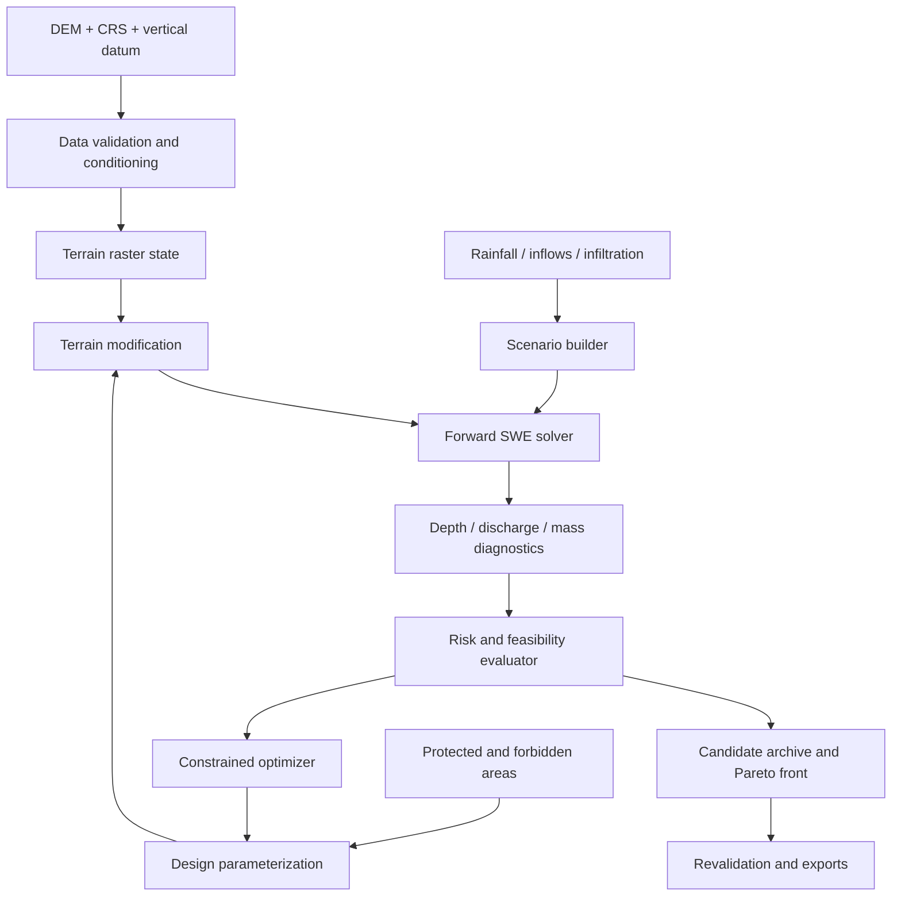

# Inverse Terrain Engine

**Technical specification and research plan**  
**Version:** 0.5  
**Status:** v0.1 MVP implemented (CPU). Implementation status, deviations and measured numbers are in Appendix B; everything else remains a design target  
**Primary language:** Rust (stable toolchain, edition 2024, pinned MSRV). See ADR-001 (Appendix A)  
**Primary target:** CPU reference + optional GPU acceleration (Metal via `wgpu` on macOS; Vulkan/DX12 where supported)  
**Runtime target:** single self-contained static binary; no Python, GDAL, async runtime, or system services required at run time  
**License target:** Apache-2.0 OR MIT for original code, subject to dependency/license review  
**Project name:** Inverse Terrain Engine (working name)

### Changes in 0.5

- **MVP implemented** as a Rust workspace (`itr-core`, `itr-hydro`, `itr-opt`, `itr-cli`; `itr-gpu` not started). Appendix B records what was built, how it deviates from this document, and the measured numbers that replace planning assumptions, as Phase B requires.
- Deviations adopted into the design:
  - the divide/sqrt budget is 9 per cell-update (§7.11.1);
  - dry skipping is row-granular, not 16×64 tiles (§7.6);
  - the cell update is two vectorized loops (flux, then sources), not one;
  - incumbent-censored results *are* cached, with the frozen incumbent in the key (§7.6);
  - GeoJSON is parsed with `serde_json`, not the `geojson` crate (§8.4).

### Changes in 0.4

- Added §19, a **technology radar** listing techniques, libraries, data sources, and tools as Adopt / Trial / Assess / Hold, each with a reason and a phase.
- **Face-crest coarse levels** (§19.1): coarse grids keep narrow berms and walls as face crest elevations, with no kernel change. This fixes the main weakness of the multi-fidelity ladder. Full subgrid volume tables, as in Casulli/3Di/HEC-RAS 2D, are on the research track.
- Decisions now driven by evidence:
  - Work-precision diagrams decide when MUSCL/second order pays for itself (§19.1).
  - lq-CMA-ES surrogate pre-screening (§19.2).
  - An external ask/tell optimizer protocol, so BoTorch/Optuna/Nevergrad can drive the engine without becoming dependencies (§19.2).
- Industry interop: LandXML/DXF grading export for civil CAD, a QGIS plugin, and design-storm and soil/land-cover data pipelines (§19.4, §19.5).
- Engineering:
  - Release hygiene: PGO, `cargo-deny`, `cargo-auditable`, SBOM, signed releases.
  - Testing: metamorphic tests, fuzzing.
  - CI: instruction-count benchmarks (§19.6).

### Changes in 0.3

- Added a first-principles bottleneck analysis (§7.11). Wall time is factored into evaluations × cells × steps × per-cell cost ÷ utilization, and each factor is attacked at its physical floor.
- **Corrected the roofline premise.** The CPU kernel is expected to be **compute-bound**, limited by divide/sqrt throughput, and the GPU kernel bandwidth-bound. The CPU kernel metric is now divides/sqrts per cell-update, with a budget of ≤ 8 down from ~16 (§7.11.1).
- New levers:
  - Steps: a baseline-locked Δt schedule, and an LTS potential measured from the baseline at no cost.
  - Cells: **subdomain replay**, which is exact at zero edit.
  - Physics: a local-inertial fidelity level.
  - Evaluations: a **flow-corridor design space** derived from the baseline.
  - Utilization: tail re-partitioning at sync points.
  - GPU: single-dispatch steps via triple-slot Δt.

### Changes in 0.2

- Added a cost model (§7.1) showing that **evaluation throughput**, not single-run speed, is the binding constraint. Architecture reorganized around it.
- Precision split: `f64` oracle kept for validation; the production hot path is `f32` state with **depth-only hydrostatic reconstruction** (terrain enters only as precomputed face jumps, so `z + h` is never formed), with `f64` ledgers (§4.1, §5.2.1, §7.3).
- Single-pass fused, in-place row-sweep CPU kernel: no flux arrays, no ping-pong buffers, CFL reduction and monitored-cell metrics fused into the update (§7.4).
- Exact (bitwise-safe) work avoidance: dry-tile skipping, checkpoint warm start, early guard-violation abort via monotone running maxima (§7.6). Row-level copy-on-write terrain shared across workers (§7.3).
- Streaming `ForwardModel` API with caller-owned workspaces and observers. Search runs store no trajectories; finalists are re-simulated deterministically (§3.2, §7.7).
- Determinism contract: bitwise-identical CPU results regardless of thread count, ISA lane width, or work-avoidance settings. Fixed 16-accumulator sums, no platform libm/FMA on the result path (§7.9).
- Numerics corrected: unsplit 2D CFL bound (`C ≤ 0.5`), source masking on wall cells, explicit subnormal flush, no-rollback abort semantics (§5.2.1, §5.3).
- GPU path: one dispatch per step, dt computed on the device, many steps per submit, candidate batching (§7.8).
- Lightweight dependency policy and formats: TOML scenarios, pure-Rust GeoTIFF, JSONL traces instead of Parquet (§8.4, §15).
- Crates consolidated from 9 to 5.
- Added Appendix A (architecture decision records). ADR-001 records the choice of Rust over C++.

### Design principles (performance and runtime)

1. **Optimize the outer loop first.** The product is "good candidates per wall-clock hour". Candidate-level parallelism, multi-fidelity, early abort, and caching come before micro-optimizing one simulation.
2. **Know which wall you are hitting.** On CPU the kernel is expected to be compute-bound, specifically divide/sqrt-throughput-bound, so the metric is divides/sqrts per cell-update. On GPU it is bandwidth-bound, so the metric is bytes per cell-update. Both are minimized, but in that priority order. Phase B measurement decides; see §7.11.1.
3. **Exactness is preserved by work avoidance.** Every shortcut is either provably result-identical (bitwise on CPU) or explicitly labelled as a fidelity change and revalidated.
4. **Zero allocation in steady state.** All buffers are owned by reusable per-worker workspaces. A counting allocator in tests enforces this.
5. **Small dependency surface.** Each dependency must justify itself. Heavy or C/C++ dependencies stay behind off-by-default cargo features.
6. **One code path, two precisions.** The solver is generic over `f32`/`f64`. The `f64` instantiation is the oracle, and the `f32` one is the workhorse.
7. **Attack every factor of the cost identity** (§7.11): evaluations × cells × steps × per-cell cost ÷ utilization. A 2× win on any factor is worth the same, and the cheapest wins are usually not in the kernel.

---

## 1. Executive summary

A conventional hydrodynamic model answers: **Given terrain, rainfall, and boundary conditions, where does water go?**

Inverse Terrain Engine asks: **What feasible, minimally disruptive changes to the terrain produce a desired hydrodynamic outcome?**

A user loads a digital elevation model (DEM), assigns rainfall and hydraulic boundary conditions, identifies protected regions, then supplies permitted interventions—such as small berms, swales, shallow cuts, or channel changes. The engine repeatedly runs a physically grounded forward simulation and searches for edits that reduce a specified damage/risk proxy while respecting engineering constraints. It returns an intervention, the simulated before/after maps, numerical diagnostics, and the trade-offs that remain.

**The research contribution is the inverse-design workflow**, not inventing a new flood solver. The software should be useful as an optimization framework even when existing validated hydraulic solvers are used as backends.

### 1.1 Example

> Given a 1 m bare-earth DEM, a specified two-hour rainfall hyetograph, one existing drainage outlet, and five protected building footprints, find a feasible set of up to three earthwork primitives that minimizes peak water depth near the buildings without increasing the maximum water depth in designated downstream areas by more than a chosen tolerance.

The optimization **does not** establish civil-engineering safety. It estimates outcomes under the supplied model, resolution, and assumptions. Professional assessment and independent verification are required for real designs.

### 1.2 Why this is worth building

- Turns maps from passive layers into *design variables*.
- Couples a high-throughput simulation core with constrained optimization, not just one-off visualizations.
- Makes counterfactuals inspectable: what changed, why the objective improved, and what got worse.
- Provides a reusable inverse-computation interface for hydrology, erosion, sunlight, or accessibility later.
- Supports research on optimization through discontinuous wet/dry dynamics and uncertain geographic inputs.

## 2. Scope and exclusions

### 2.1 MVP capabilities (v0.1)

1. Import projected, single-band DEM rasters, optionally with roughness, masks, building polygons, and rainfall series.
2. Provide a conservative **two-dimensional depth-averaged shallow-water equations (SWE)** CPU reference implementation.
3. Add rainfall and bounded infiltration sinks with consistent mass bookkeeping; explicitly handle domain boundaries.
4. Support rectangular, constant-resolution Cartesian tiles at first.
5. Define an earthwork design in terms of a small set of local, smooth primitives (e.g., berm, swale, cut), with hard spatial masks and box constraints.
6. Define damage proxies from simulated water depths and hydrodynamic conditions at protected and downstream locations.
7. Use derivative-free optimization as a robust baseline; produce Pareto alternatives if objectives conflict.
8. Export proposed terrain, depth/time rasters, diagnostics, optimizer trace, and a reproducible run manifest.
9. Run standard analytical/numerical tests and compare reference cases to established flood-model benchmarks.
10. Include a minimal browser-based 2D/3D before/after viewer; solver and CLI remain fully headless.

### 2.2 Not in v0.1

- Design certification, forecasting, real-world flood guarantees, drainage permit compliance.
- Full underground storm sewer / culvert / pump / gate coupling.
- Sediment transport, erosion, landslides, dam-break structural failure.
- Live hydrometeorological forecasting, real-time assimilation, or hydrological catchment model.
- Fully differentiable SWE including exact gradients through wet/dry fronts.
- Unrestricted per-cell terrain optimization over millions of unconstrained variables.
- Global-scale terrain simulation; this is a **local** projected-area computational tool.

### 2.3 Explicit assumptions

- The computational model treats water as depth-averaged, incompressible, and hydrostatic where SWE assumptions are acceptable.
- DEM elevations represent terrain with declared datum and resolution; roads, bridges, walls, curbs, and underground infrastructure require explicit treatment if hydraulically relevant.
- Rainfall-runoff routing requires either explicit rainfall with appropriate losses or a supplied hydrograph; *rainfall is not automatically equivalent to direct runoff*.
- Each scenario has a fully specified time window, roughness, initial conditions, boundary conditions, and solver version.
- Optimization can move water **elsewhere**. Constraints must evaluate downstream and offsite consequences, not just protected assets.

## 3. System architecture



### 3.1 Components

Five crates. Fewer crates keep compile times, versioning, and cross-crate inlining simple. Module boundaries inside a crate still enforce the layering.

| Crate | Modules | Responsibility | Rules |
|---|---|---|---|
| `itr-core` | `grid`, `units`, `mask`, `crs`, `scenario`, `model`, `design`, `objective`, `manifest` | Grid types and conventions, scenario types and TOML parsing (`serde`/`toml`; parsing from a string, no file access), the `ForwardModel`/`Observer`/`RunSummary`/`SyncView` contracts, earthwork primitives, static feasibility, metric definitions, run provenance | No I/O, no threads, no GPU. `#![forbid(unsafe_code)]` |
| `itr-hydro` | `kernel`, `boundary`, `forcing`, `ledger`, `workspace`, `observer` | CPU SWE solver generic over `f32`/`f64`, mass ledger, fused monitored metrics | Depends only on `itr-core`. Testable without optimizer. `unsafe` limited to audited kernel module, if any |
| `itr-opt` | `random`, `coord`, `cmaes`, `archive`, `evaluator`, `cache` | Optimizers, candidate scheduler, archive, Pareto filter | Depends on `itr-core` (+ `rayon`, `libm`, `rand_chacha`). Seeded, restartable, deterministic. Talks to the solver only through `ForwardModel`. Persists via a `Sink` trait implemented by the CLI |
| `itr-gpu` | `wgsl`, `batch` | Optional `wgpu` solver backend implementing `ForwardModel` | Feature-gated (`gpu`). May differ numerically; compared against CPU |
| `itr-cli` | `io`, `cmd` | Binary: GeoTIFF/GeoJSON/TOML I/O, commands, exports, viewer bundle | Only crate that touches the filesystem |
| `viewer/` (not a crate) | — | Static HTML + WebGL2 viewer reading exported files | No build step required to open; pure visualization |

**Hard architectural boundary:** the forward-solver interface cannot depend on the optimizer. The optimizer asks the simulator for trajectories and metrics, not the reverse. File I/O stays out of the core and solver crates so they remain embeddable (e.g., later Python or WASM bindings) without dragging in format dependencies.

### 3.2 Core contracts

The solver API is **streaming and caller-allocated**. Simulation results are never materialized as full trajectories during search.

```rust
/// Reusable, preallocated buffers for one grid shape. Created once per worker.
pub trait Workspace: Send {}

pub trait ForwardModel: Sync {
    type Ws: Workspace;
    fn workspace(&self, shape: GridShape, monitors: &MonitorSet) -> Self::Ws;

    /// Advances from `start` (initial condition or checkpoint) to the scenario end
    /// or until an observer breaks. Never allocates once `ws` is warm.
    fn run<O: Observer>(
        &self,
        ws: &mut Self::Ws,
        terrain: &PreparedTerrain,          // z + derived face data, see §7.3
        scenario: &PreparedScenario,        // hashed, validated, unit-normalized
        start: StartState<'_>,
        observer: &mut O,
    ) -> Result<RunSummary, SimulationError>;
}

/// Called at sync points (§7.5), not per cell. Hot-path metrics (running max at
/// monitored cells, ledger terms) are fused into the kernel and exposed read-only here.
pub trait Observer {
    fn on_sync(&mut self, view: &SyncView<'_>) -> core::ops::ControlFlow<AbortReason>;
}

pub trait DesignSpace {
    fn dimension(&self) -> usize;
    fn bounds(&self) -> &[(f64, f64)];
    /// Deterministic. Writes the edit into a caller-owned sparse buffer (bbox + Δz).
    fn materialize(&self, theta: &[f64], res: Resolution, out: &mut TerrainEdit) -> Result<(), DesignError>;
    /// Cheap, simulation-free checks (§6.2). Must run in O(edit bbox).
    fn static_violations(&self, edit: &TerrainEdit, out: &mut Vec<ConstraintViolation>);
}

pub trait Objective {
    /// Which cells must be tracked in the hot loop (protected ∪ guard [∪ full domain]).
    fn monitors(&self) -> MonitorSet;
    fn evaluate(&self, run: &RunSummary, edit: &TerrainEdit, baseline: &BaselineRef) -> ObjectiveReport;
    /// Optional exact early-abort test on monotone running quantities (§7.6).
    fn certainly_infeasible(&self, view: &SyncView<'_>, baseline: &BaselineRef) -> bool { false }
}
```

Generics (not `dyn`) are used on the hot path, and `dyn` only at the CLI boundary. Unit newtypes (`Meters`, `Seconds`, `CubicMeters`) are used at API boundaries. Kernels operate on raw `f32`/`f64` slices.

*These are illustrative contracts, not validated compilable crate APIs.*

## 4. Data contract

### 4.1 Core raster grid

- Elevation is stored **re-based**: `z_local = z_input − z_ref`, where `z_ref` is the domain's minimum valid elevation, rounded down to a whole metre and recorded in the manifest. All exports add `z_ref` back.
- The solver state is **depth `h`, not free surface `η`**. The kernel **never forms `z + h`** and never reads `z` at all. Terrain enters only through per-face elevation jumps `Δz = z_R − z_L`, computed in `f64` from the input and then rounded once to the working precision (§5.2.1, §7.3). Small jumps are therefore represented to full relative precision, and mm-scale films are not cancelled against 100 m+ elevations. This holds in `f32` regardless of absolute elevation or relief.
- Precision: `f64` for the CPU oracle build, `f32` for production CPU and GPU runs, selected by a generic `Real` parameter. Ledger totals are always `f64`. Within-row partials may be `f32` with a fixed summation layout (§7.4); GPU uses fixed-order partial sums (§7.8).
- `cell_size_x_m`, `cell_size_y_m`, `origin`, affine transform; positive cell areas required. v0.1 hot kernels assume uniform `dx`, `dy` (scalars, not arrays).
- Horizontal CRS: **projected metric** coordinates for solver computations; do not operate directly on longitude/latitude degrees.
- `vertical_datum`, elevation units, conversion record, collection date, nodata mask, uncertainty metadata if supplied.
- Immutable baseline terrain; edits stored separately as sparse design records and deterministic derived raster.
- Array ordering: row-major with explicit `row`, `col`, and coordinate direction; no ambiguous Y-axis convention.
- Geometry obstacles and excluded regions rasterized with a documented cell-coverage policy.
- **Nodata and solid obstacles are encoded branch-free.** They are given `z_local = z_wall` (well above any reachable water surface, e.g. `max(z) + 100 m`) with `h = 0`. Under hydrostatic reconstruction this produces zero face depth, i.e. an exact reflective wall with balanced bed source, with no per-face branches. A separate bitmask keeps them out of metrics and exports. Do not use `±inf`/NaN sentinels in solver arrays.
- **Protected footprints** are configurable via `objectives.building_mode`:
  - `"ground"` (default): cells stay hydraulically active and their depth is monitored.
  - `"wall"`: the footprint is solid, and the monitored set is the 1-cell ring outside it.
  
  A wall footprint must never be monitored directly, since it always reports zero depth.
- In-memory layout: structure-of-arrays, row-major, with a **1-cell ghost halo** (2 cells if MUSCL is enabled). Each row is left-padded so the **first interior cell** (not the halo cell) is 64 B aligned, and right-padded to a multiple of 16 elements. Arrays live in a 64 B-aligned arena (`Vec<f32>` alone guarantees only 4 B alignment). Inner loops therefore have no peel or remainder handling. Logical `(row, col)` indexing is exposed through `GridShape`, never by raw stride arithmetic outside the kernel module.

### 4.2 Boundary conditions

Supported at first:

- Impermeable / reflective wall.
- Specified stage (water-surface elevation) with stable boundary flux treatment.
- Prescribed inflow hydrograph at designated face(s), with units and time interpolation.
- Simple outgoing / transmissive boundary only after validation; never label it “open” without stating its reflection behavior.

Different boundaries require appropriate ghost states or consistent numerical face treatment, not arbitrary water removal.

### 4.3 Forcing

- Rainfall: `rate_m_per_s`, piecewise-constant or piecewise-linear time points. Simulation time `t` is `f64` (accumulated as `t += Δt as f64`), and sync clipping is done in `f64`, so step counts are reproducible. Per step, the solver applies the **exact integral** of the hyetograph over `[t, t+Δt]` (closed form for piecewise-linear), not `rate(t)·Δt`. The ledger then matches the declared event volume to roundoff, with no dependence on step size. Spatially uniform rain is a scalar per step. Spatially varying rain (later) is a per-cell multiplier raster × scalar time series, to keep bandwidth low.
- Infiltration: **initial option** is bounded prescribed infiltration depth per step, `min(capacity·Δt, h + rain_depth)` (applied after the rain source within the same cell update, so `h ≥ 0` is preserved exactly). Later add Green–Ampt or calibrated runoff losses (needs one extra state array for cumulative infiltration).
- Roughness: Manning's `n` stored as a raster or constant; validate ranges and units.
- Initial depth/discharge may be zero or supplied rasters.
- Land cover can help assign roughness, but those mappings are assumptions and must be traceable.

### 4.4 Suggested scenario file

Scenarios are **TOML**. It is unambiguous (no implicit typing, no "Norway problem"), has a well-maintained pure-Rust parser, and is easy to diff. `serde_yaml` is unmaintained and is not used. JSON is accepted as an equivalent machine-generated form.

```toml
schema_version = "0.2"
scenario_id = "synthetic-valley-001"

[terrain]
path = "data/dem_projected.tif"
crs = "EPSG:32643"                    # must be projected, metric; checked, never reprojected in-engine
vertical_datum = "example-local-datum"
elevation_units = "m"
expected_cell_size_m = 2.0

[hydrology]
duration_s = 7200
sync_interval_s = 60                  # dt is clipped to land on these instants (§7.5); part of scenario hash
rainfall_hyetograph = [               # [time_s, rate_mm_h], piecewise-linear
  [0, 0], [300, 60], [2100, 20], [3900, 0],
]
manning_n = 0.04
initial_depth_m = 0.0

[hydrology.infiltration]
model = "constant_capacity"
capacity_mm_h = 5.0

[boundaries]
default = "wall"
segments = []

[design]
editable_mask = "data/allowable_edits.geojson"
primitives = "data/earthworks.toml"
placement = "corridor"                # "corridor" | "free" (§7.11.4)
free_placement_fraction = 0.2
max_abs_elevation_change_m = 0.75
max_earthwork_volume_m3 = 10000
quantize = { height_m = 0.01, position_m = 0.5, width_m = 0.5 }   # §6.1
require_no_offsite_worsening = true

[objectives]
protected_areas = "data/buildings.geojson"
downstream_guard_areas = "data/downstream.geojson"
depth_threshold_m = 0.10
guard_tolerance_m = 0.02              # ε_guard in §6.3
building_mode = "ground"              # "ground" | "wall" (§4.1)
monitor_full_domain = false           # full-grid running max costs ~1 extra RW array per step

[solver]
method = "fv1_hll_hr"                 # first-order, HLL, hydrostatic reconstruction
precision = "f32"                     # "f64" = oracle
backend = "cpu"                       # "cpu" | "gpu"
dt_mode = "adaptive"                  # "adaptive" | "baseline_locked" (§7.11.2)
subdomain_replay = "auto"             # "off" | "auto" (§7.11.3)
cfl = 0.35                            # ≤ 0.5 (unsplit 2D bound, §5.3)
dt_max_s = 5.0
h_dry_m = 1e-6
h_eps_m = 1e-5

[optimizer]
method = "cma_es"
seed = 12345
population = 12                       # optional; default 4 + floor(3 ln n)
max_simulations = 500                 # and/or max_cell_updates
fidelity_levels = [4, 2, 1]           # coarsening factors, coarse → final (§7.7)
screening_physics = "local_inertial"  # physics for coarse levels; final level is always HLL (§7.11.2)
```

Values are **illustrative**. The schema uses `#[serde(deny_unknown_fields)]` and MUST reject unknown keys and unsupported boundary configurations instead of silently accepting them. Hashing is split:
- **Problem hash**: terrain, hydrology, boundaries, design, objectives, plus input file content hashes.
- **Solver hash**: method, precision, backend, CFL, thresholds.

Cache keys combine both (§7.6), so CLI overrides like `itr validate --precision f64` stay correctly keyed. Host-execution settings (`threads`, memory budget, checkpoint budget) live in CLI flags or `itr.toml`, not in the scenario, because they never affect results.

## 5. Mathematical and numerical model

### 5.1 State

On domain \(\Omega\), let \(z(x,y)\) be the static bed elevation; \(h\ge0\) water depth; \(u,v\) depth-averaged velocities; and \(q_x=hu, q_y=hv\) unit-width discharges.

\[
U=\begin{bmatrix}h\\q_x\\q_y\end{bmatrix},\quad
\partial_t U+\partial_x F(U)+\partial_y G(U)=S_{bed}+S_{friction}+S_{rain}-S_{infiltration}.
\]

\[
F(U)=\begin{bmatrix}q_x\\q_x^2/h+gh^2/2\\q_xq_y/h\end{bmatrix},\quad
G(U)=\begin{bmatrix}q_y\\q_xq_y/h\\q_y^2/h+gh^2/2\end{bmatrix}.
\]

With dry-state limits handled safely, source terms include

\[
S_{bed}=\begin{bmatrix}0\\-gh\partial_x z\\-gh\partial_y z\end{bmatrix},\qquad
S_{rain/infiltration}=\begin{bmatrix}r-i\\0\\0\end{bmatrix}.
\]

Rainfall and infiltration momentum effects are neglected initially and this assumption must be disclosed. A consistent method for rainfall/infiltration source splitting and bed friction will be documented and validated.

### 5.2 Finite-volume discretization

For cell \(i,j\) with area \(A=\Delta x\Delta y\):

\[
U_{ij}^{n+1}=U_{ij}^{n}-\frac{\Delta t}{\Delta x}(\hat F_{i+1/2,j}-\hat F_{i-1/2,j})
-\frac{\Delta t}{\Delta y}(\hat G_{i,j+1/2}-\hat G_{i,j-1/2})+\Delta t\,\hat S_{ij}.
\]

Design choice for v0.1:

1. First-order Godunov-style finite-volume update as correctness baseline.
2. Positivity-preserving **hydrostatic reconstruction** at faces to maintain nonnegative reconstructed depths.
3. HLL-family numerical flux and bed-source correction paired consistently with the reconstruction so a lake-at-rest equilibrium remains nearly stationary.
4. Wet/dry threshold and safe regularized velocity division; verify conservation as wet fronts cross dry cells.
5. Manning friction with a stable semi-implicit treatment; test against known decay or steady-flow cases.
6. Optional second-order MUSCL/SSP-RK2 only **after** the first-order solver passes the regression suite.

A simple stencil without well balancing is not acceptable: slope and wet/dry errors can dominate any purported optimization benefit.

#### 5.2.1 Concrete scheme choices (v0.1)

| Element | Choice | Rationale / cost note |
|---|---|---|
| Reconstruction | Audusse et al. (2004) hydrostatic reconstruction in **depth-only form**: with face jump `Δz = z_R − z_L`, `h_L* = max(0, h_L − max(Δz, 0))`, `h_R* = max(0, h_R − max(−Δz, 0))`; source correction `g/2·(h² − h*²)` per side | Mathematically identical to `max(0, η − max(z_L, z_R))` but free of `z+h` cancellation. `Δz` depends only on terrain and is **precomputed per candidate** into face arrays `dzx`, `dzy` |
| Alternative reconstruction | Chen & Noelle (2017) modified HR, behind the same trait | Standard HR is known to lose accuracy for thin flows on steep slopes, which is exactly rain-on-grid. Selected only if the tilted-plane test (§9.1) shows it is needed |
| Flux | HLL with wave speeds from the two-rarefaction estimate (Toro), built only from `u` and `c* = √(g h*)` on each side. Einfeldt/Roe averages are rejected because they add a sqrt and a divide per face (§7.11.1) | Branch-light. Wet/dry cases are expressed as `select`s so they vectorize. **Dry–dry faces return exactly zero** via explicit select (the HLL denominator `S_R − S_L` would be 0). This property is what makes dry-tile skipping and warm start exact (§7.6) |
| Velocity | Desingularized `u = 2h·q / (h² + max(h², h_ε²))`, with `h_ε` = `h_eps_m` (default `10·h_dry`) | Avoids division blow-up in thin films without clamping mass. Equals `q/h` for `h ≥ h_ε` |
| Friction | Point-implicit Manning after the flux update: `q ← q / (1 + Δt·g·n²·|q| / h^{7/3})`, with `h^{-7/3} = (1/h)² · h^{-1/3}`, reusing `1/h` from the velocity step and computing `h^{-1/3}` by a multiplication-only Newton iteration `r ← r·(4 − h·r³)/3` from a bit-level seed | Unconditionally stable for the friction term. No `powf`, no `cbrt`, and only one division in the hot loop; `g·n²` precomputed (scalar, or a per-cell array only if `n` varies) |
| Sources | Rain → infiltration → friction, applied in that order inside the same cell update | Single pass; preserves `h ≥ 0` exactly; order documented and fixed |
| Momentum on drying | If `h_new < h_dry` then `q = 0` (mass untouched). Additionally, `|q| < q_min` → `q = 0` | Velocity reset only. Mass is never removed, so the ledger stays exact. The `q_min` flush is an explicit, portable `select` that keeps decaying momentum out of **subnormals** (100+ cycle penalty on x86). The kernel does not rely on FTZ/DAZ CPU flags, whose availability differs by architecture |
| Time step | `Δt_{n+1}` from the post-update state, computed inside the same pass, using the unsplit 2D bound below | No separate reduction sweep. Initial `Δt₀` comes from a one-off pre-pass over the initial state |
| Source masking | Rain, infiltration, and inflow are multiplied by a `wet_mask ∈ {0,1}` (0 for walls/nodata); the ledger sums only masked-in cells | Otherwise rain would fill wall cells, which then leak water and corrupt the ledger |

Hot-loop budget per cell per step (first-order, `f32`): reads `h, qx, qy, dzx, dzy` (+ optional `n`), writes `h, qx, qy`. About 32–36 B moved and about 100–200 flops. Divides and square roots are the scarce resource: ≤ 8 per cell-update by construction (§7.11.1), versus ~16 for a naive implementation. On CPUs this kernel is expected to be compute-bound and on GPUs bandwidth-bound. Measured roofline placement is a Phase B deliverable.

### 5.3 Time stepping

Use a CFL-bound time step:

\[
\Delta t = \min\!\left(\Delta t_{\max},\; \frac{C_{\mathrm{CFL}}}{\max_{i,j}\left(\frac{|u|+\sqrt{gh}}{\Delta x}+\frac{|v|+\sqrt{gh}}{\Delta y}\right)}\right),\qquad C_{\mathrm{CFL}} \le 0.5
\]

over wet cells. This is the **unsplit 2D bound** required for positivity of first-order HR+HLL. The per-direction `min(Δx/a_x, Δy/a_y)` form does *not* guarantee `h ≥ 0` in 2D. `Δt_max` (config `dt_max_s`) covers all-dry or nearly still domains, where the bound would otherwise be infinite. Test near-dry cells and high topographic gradients.

The in-place update has **no rollback**. A step whose health check (§7.4) fails aborts the run with a diagnostic; there are no silent retries. Safeguards are counted and logged, with no hidden clamping that breaks mass balance.

The global time step is set by the single fastest/deepest wet cell. A small deep pond can therefore throttle the whole domain. Local time stepping (LTS, power-of-two sub-cycling per tile) is the main algorithmic speedup available for flood problems. It is deferred to Phase E (research track) because it complicates the determinism and ledger proofs. The `Δt` sequence is still logged per run so the potential LTS gain can be estimated from real runs before investing in it.

**Δt independence from outputs.** `Δt` is clipped only to land on the scenario's `sync_interval_s` grid and the end time. It is never clipped to snapshot or export requests. So a run with full outputs and a run with none follow a **bitwise-identical trajectory** on the same backend and precision, which is what makes "re-simulate finalists instead of storing trajectories" (§7.7) valid.

### 5.4 Mass ledger

For each step, track:

\[
V_{n+1}-V_n = V_{rain}+V_{inflow}-V_{infiltration}-V_{outflow}+\epsilon_{num}
\]

where volumes use cell areas and integrated boundary-face discharges. Expose absolute and scaled residuals. **Never** disguise a numerical mass leak as infiltration or outflow.

## 6. Design representation and inverse problem

### 6.1 Earthwork parameterization

Avoid millions of free cell elevations in v0.1. Use a small interpretable parameter vector \(\theta\):

\[
z_\theta(x,y)=z_0(x,y)+M(x,y)\sum_{k=1}^{K}a_k\,\phi_k(x,y; c_k,w_k,\psi_k)
\]

- \(M(x,y)\in\{0,1\}\): editable mask.
- \(\phi_k\): smooth compactly supported berm/cut/swale footprint.
- \(a_k\): signed height change; \(c_k\): center; \(w_k\): width; \(\psi_k\): orientation/path control parameters.
- Primitive examples: radial mound, oriented Gaussian-like ridge truncated at support, spline-aligned channel, piecewise grade adjustment.

**Avoid Gaussian tails outside the editable mask**. Apply mask first, then evaluate slope feasibility along mask edges.

Implementation rules:

- **Compact support by construction.** Profiles are polynomial bumps of signed distance to a point, segment, or polyline. Use C¹ `(1−s²)²` or C² Wendland-type falloff with `s = d/w ∈ [0,1]`, exactly zero outside the support. Every edit then has an exact axis-aligned bounding box. Materialization, slope checks, volume, and face-array updates cost O(bbox), not O(grid).
- **Resolution-independent.** Primitives are continuous functions of world coordinates. The same `θ` can be materialized at any fidelity level (§7.7) by area-averaging over each cell (fixed 4×4 sub-sample quadrature, deterministic). A primitive narrower than about 3 cells at a given level is flagged as **unresolved** at that level. Rankings from that level are not trusted for it.
- **Quantized parameters.** `θ` is snapped to declared construction tolerances (e.g. 1 cm height, 0.5 m position) before materialization. This reflects real earthwork precision, makes the candidate cache (§7.6) effective, and stops the optimizer from chasing sub-tolerance noise.
- **The discrete edit is the truth.** Cut/fill volumes are the exact cell sums `Σ max(±Δz, 0)·A` of the materialized raster, never analytic primitive volumes.
- Overlapping primitives are summed, then clamped to `±max_abs_elevation_change_m`. The clamp is part of the deterministic materialization and is reflected in the reported volumes.

### 6.2 Hard constraints

- Protected/no-edit zones (buildings, utilities, roads where specified).
- Maximum positive/negative elevation changes.
- Maximum earthwork cut/fill volume and optional approximate balance.
- Local slope/grade constraints and minimum channel widths.
- No new disconnected pits unless explicitly allowed; drainage connectivity checks.
- Downstream guard regions must not exceed user-specified tolerance under the comparison scenarios.
- Optional cost-weighted intervention area and haul distance proxies.

A candidate violating hard constraints is rejected *before* running expensive hydraulics, except constraints that necessarily depend on the simulated trajectory.

Static checks cost microseconds to milliseconds and simulations cost seconds to minutes. So statically infeasible proposals are **resampled** by the optimizer, up to a bounded number of attempts per slot, and logged. They are not spent as penalized simulations. Only trajectory-dependent constraints (guard regions) consume simulation budget, and those are eligible for exact early abort (§7.6). Budget accounting counts **simulated cell-updates** as well as simulation calls, because aborted and coarse-level runs are cheaper than full ones.

### 6.3 Objective vector

For assets \(b\), define \(D_b(\theta)=\max_{t\in[0,T]} h_b(t;\theta)\), where the polygon-to-raster aggregation operator is stated explicitly (maximum or area-averaged depth). A representative smooth search surrogate:

\[
J_{risk}(\theta)=\sum_b w_b\,\log\left(1+\exp\left[\frac{D_b(\theta)-d_b}{\tau}\right]\right)\tau.
\]

Here \(d_b\) is the preferred depth threshold and \(\tau\) is a numerical smoothing scale. **Reporting uses the true depth and threshold exceedance**, not only a smooth surrogate.

Earthwork cost proxy:

\[
J_{earth}(\theta)=c_{cut}\int_\Omega\max(-\Delta z,0)\,dA+c_{fill}\int_\Omega\max(\Delta z,0)\,dA.
\]

Optional runoff displacement constraint:

\[
\max_{x\in\Omega_{guard}}\big[D_\theta(x)-D_0(x)\big]\le \varepsilon_{guard}.
\]

Use two recommended optimization modes:

1. **Constrained scalar:** minimize \(J_{risk}+\lambda J_{earth}\), subject to feasibility and guard constraints.
2. **Pareto:** return nondominated outcomes in risk, earthwork, and downstream worsening; let users select trade-offs.

Do not silently merge incomparable units into one objective without disclosed normalization.

### 6.4 Optimization algorithms

**MVP:** fixed-seed random search + coordinate search + restartable CMA-ES over ~8–40 parameters. Compare against identical simulation budgets. CMA-ES is a candidate, not an unconditional winner.

Implementation notes:

- **Generation-synchronous batches.** Each generation's λ candidates are proposed, evaluated in parallel, and then ranked in index order. Results do not depend on completion order or thread count.
- **In-house CMA-ES** (~400 LOC). A small symmetric Jacobi eigensolver suffices for n ≤ 64, which avoids a linear-algebra dependency. Box bounds are handled by reflection. Infeasible trajectory results are ranked feasibility-first (Deb's rules) rather than by penalty weights. IPOP restarts are supported. State is serialized each generation for exact resume.
- **RNG is pinned:** `ChaCha8` from `rand_chacha` with an explicit version, or an in-house PCG64. Never `rand::StdRng`, whose algorithm is not stable across `rand` releases and would silently break trace reproducibility.
- λ is the config key `optimizer.population`. Its default `4 + ⌊3 ln n⌋` depends only on the dimension `n`, **never on worker count**, otherwise traces would vary between machines. Users with many cores raise `population` explicitly.

**Next:** surrogate-assisted constrained Bayesian optimization for expensive simulations; multiple fidelities using coarse/fine grids. Use independent validation at final resolution; do not compare coarse and fine scores as if interchangeable.

**Research:** differentiable or adjoint-assisted optimization. Obstacles include wet/dry topology changes, limiter nonsmoothness, adaptive time stepping, and hydrodynamic shocks. Compare gradients against central finite differences at smooth points; never treat differentiability as solved merely because the GPU framework supports autodiff.

### 6.5 Pseudocode

```text
for level in fidelity_levels:                         # e.g. [4, 2, 1]
    baseline[level] = simulate(original_dem@level, scenario, checkpoints=on)   # §7.6
pool = WorkerPool(workspaces preallocated per worker)
optimizer = create_optimizer(seed, bounds)
archive = []
while budget_remaining():
    batch = []
    for slot in 0..lambda:                            # resample statically infeasible proposals
        theta, edit = propose_until_static_feasible(optimizer, max_attempts)
        batch.push(theta, edit)                       # quantized θ; edit = bbox + Δz
    results = pool.evaluate_parallel(batch, level):   # one candidate per worker (§7.7)
        key = hash(model_version, problem_hash, solver_hash, level, quantized θ)
        if cache.hit(key): return cached
        terrain = prepare(baseline_terrain@level, edit)          # O(bbox) face-array patch
        start = latest_baseline_checkpoint_before(first_influence_time(edit))  # exact warm start
        run(terrain, scenario, start, observer=GuardAbort+Diagnostics)          # may abort exactly
    optimizer.tell(batch, results in index order)     # deterministic
    archive.extend(batch, results)
    maybe_promote_to_finer_level(archive)             # §7.7 successive halving

finalists = pareto_filter(archive at level 1)
for theta in finalists:
    rerun_with_full_outputs(theta)                    # bitwise-identical to search run (§5.3)
    validate_on_finer_grid_and_scenario_ensemble(theta)
export_all_inputs_outputs_seeds_versions_and_units()
```

### 6.6 Multi-scenario robustness (v0.2)

For event set \(\mathcal S\) with specified rainfall, upstream levels, or uncertain roughness:

\[
J_{robust}(\theta)= \mathbb E_{s\sim \mathcal S}[J(\theta,s)] + \beta\,\operatorname{CVaR}_{\alpha}(J(\theta,s)).
\]

Report scenario composition and uncertainty model; CVaR is meaningful only when the scenario distribution is justified. Connect to the separate **Spatial Uncertainty Engine** later without taking it as a dependency in v0.1.

## 7. Compute and performance architecture

### 7.1 Cost model (why the architecture looks like this)

For an explicit CFL-limited scheme on a square domain of side `L` with cell size `Δx`, simulated duration `T`, and characteristic wave speed `c = |u| + √(gh)`:

\[
\text{cell-updates per run} \approx \underbrace{(L/\Delta x)^2}_{\text{cells}} \cdot \underbrace{\frac{T\,c}{C_{\mathrm{CFL}}\,\Delta x}}_{\text{steps}} \;\propto\; \Delta x^{-3}.
\]

Worked example (planning arithmetic, **not** a performance claim): 512² cells at 2 m, `T = 7200 s`, `c ≈ 4.6 m/s` (1 m deep, 1.5 m/s), `C = 0.35`. That gives about 48 k steps, so about **1.3 × 10¹⁰ cell-updates per simulation**. If a core sustains an assumed 10⁸ cell-updates/s, that is about 2 min per simulation per core. A 500-simulation search is then about 17 core-hours. Hence:

1. **Search throughput dominates.** Per-run speedups matter, but candidate parallelism (§7.7), multi-fidelity (the `Δx⁻³` law: 2× coarser ≈ 8× cheaper), exact work avoidance (§7.6), and caching multiply together.
2. **Per-cell cost is set by arithmetic on CPU and by memory traffic on GPU** (§7.11.1). The CPU kernel is designed to a divide/sqrt budget; the GPU kernel to a byte budget.
3. **One deep cell sets Δt for all cells.** Δt statistics are logged so the value of local time stepping (§5.3) can be quantified.

Phase B must replace the assumed throughput with measured numbers and re-derive the budgets in §10.

### 7.2 CPU correctness first

- A **scalar `f64` oracle** path (same formulas, no fusion, no SIMD, explicit flux arrays) is written first and kept forever as the reference. Every optimized path is tested against it.
- Optimized paths are introduced one transformation at a time (fusion → in-place → parallel strips → `f32` → SIMD dispatch). Each is checked against the oracle: bitwise where the transformation is exact, tolerance-bounded where it is not (precision change).
- Profile flux evaluation, boundaries, memory bandwidth, and serialization separately. Report achieved GB/s and cell-updates/s against a measured `STREAM`-style bandwidth roofline of the host.

### 7.3 Prepared terrain and precision

`PreparedTerrain` is built once per candidate and is read-only during a run:

- `dzx[i+½,j] = z_{i+1,j} − z_{i,j}` and `dzy` likewise: face elevation jumps, computed in `f64` and rounded once. The kernel reads only these, never `z` (§4.1). `z` itself is kept for materialization and export.
- `gn2` as a scalar, or a per-cell array only if roughness varies.
- Wall/nodata encoding (§4.1), so the kernel has no mask branches.

**Row-level copy-on-write.** Face arrays are accessed through a per-row slice table, and the kernel already works row by row, so this indirection costs nothing. Rows outside the candidate's edit bbox (+1) point at the **shared read-only baseline**. Rows inside it point at worker-private rows from a preallocated pool, patched in O(bbox). Concurrent candidates then share the baseline terrain in the last-level cache instead of streaming 16 private copies, and switching candidates costs O(bbox) with no full-grid copy and no allocation.

Precision policy:

| Path | State | Fluxes/arithmetic | Reductions / ledger |
|---|---|---|---|
| Oracle (CPU) | `f64` | `f64` | `f64` |
| Production CPU | `f32` | `f32` | fixed-layout per-row `f32` partials → `f64` across rows in row order; boundary fluxes in `f64` |
| GPU | `f32` | `f32` | per-workgroup Kahan `f32` → host `f64` at sync points |

Optimization rankings from `f32` runs are spot-checked against `f64` reruns (the top-k of each search and a random sample). Reported final metrics always come from a declared precision.

### 7.4 Fused CPU kernel: single pass, in place

One pass over the grid per time step does everything: reconstruction, fluxes, update, sources, friction, the next step's wave-speed max, monitored-cell running maxima, ledger partials, and activity flags. **No full-grid flux arrays and no ping-pong state buffers.**

Row-sweep scheme within a strip of rows `[a, b)`:

```text
G_prev ← boundary_flux_row[a−½]              # precomputed (see below)
for j in a..b:
    G_next ← (j+1 < b) ? yflux(row j, row j+1) : boundary_flux_row[b−½]   # old values, untouched yet
    F      ← xflux(row j)                       # row buffer, length nx+1, vectorized
    update row j in place from F, G_prev, G_next; apply rain → infiltration → friction
    fused: s_max = max(s_max, |u|+√(gh)); running max at monitored cells of row j;
           ledger partials for row j; tile activity flags
    G_prev ← G_next                             # swap buffers
```

- Each face is evaluated exactly once. Each face stores 4 values (mass, left/right normal momentum including the hydrostatic-reconstruction source correction, tangential momentum). Row buffers total about `3 × (nx+1) × 16 B`. A 2048-wide grid uses about 100 KB, which sits in L1/L2.
- **Parallel strips.** Strip height is a fixed constant (e.g. 32 rows), independent of thread count. A short pre-phase computes the y-face flux rows at every strip boundary from the old state, then all strips sweep in parallel. Boundary faces are computed by the same function with the same inputs, so the result is bitwise identical to a serial sweep.
- Monitored cells (protected ∪ guard [∪ all]) are a row-sorted index list. Running-max updates happen while the row is hot in L1, at a cost proportional to the number of monitored cells. A full-domain running max is opt-in.
- Health check fused in: `bad |= !(h >= 0)` catches negative depth and NaN. (Note: `f32::max` silently drops NaN, so NaN detection must not rely on the wave-speed max.)
- **Fixed summation layout.** Every floating-point sum in the kernel (ledger partials, volume) uses 16 independent accumulators indexed by `col mod 16`, combined by a fixed pairwise tree, then by row order in `f64`. The result does not depend on ISA lane width (NEON 4, AVX2 8, scalar 1) or runtime dispatch, which D0/D1 require. Only `max`/`min` reductions, which are order-independent, may be left to the compiler.
- **SIMD:** inner loops are straight-line, `select`-based, over padded rows in `chunks_exact(16)`, written for LLVM auto-vectorization on stable Rust. Hot-loop vectorization is inspected per release (`cargo-show-asm`). Multi-versioned for x86-64 (`avx2`) via runtime feature detection; NEON is the aarch64 baseline. If auto-vectorization proves unreliable, port the kernel to the `wide` or `pulp` crate. No nightly `std::simd`.
- **Transcendentals:** the kernel uses only `+ − × ÷ √` (all correctly rounded in IEEE 754) plus an in-house multiplication-only inverse-cube-root `h^{-1/3}` (bit-level seed + fixed Newton steps), shared with the oracle so comparisons can be bitwise. Hardware approximate reciprocal/rsqrt instructions (`rcpps`, `rsqrtps`, `frecpe`) are **banned**: their results differ between vendors, which breaks D1. No platform `libm` and no `mul_add` in the kernel. This keeps it vectorizable and bitwise reproducible across OS/architectures (§7.9). Rust never contracts `a*b+c` into FMA implicitly.

Planned DRAM traffic per cell-update ≈ **32 B** (`f32`, constant roughness: read `h, qx, qy, dzx, dzy`, write `h, qx, qy`; +4 B for a roughness raster). The `f64` oracle moves about 2× that, plus flux arrays.

### 7.5 Sync points

The run advances in **sync intervals** (`sync_interval_s`, part of the scenario). At each sync instant, which Δt is clipped to hit exactly (§5.3), the solver:

- finalizes the ledger (total volume pass plus accumulated fluxes) and checks the residual;
- calls `Observer::on_sync` (early abort, progress, snapshot capture in output runs);
- may write a checkpoint (baseline runs only, §7.6).

No other host-visible work happens between sync points. On the GPU, this is also the only time the host reads back data.

### 7.6 Exact work avoidance

All items below leave reported results and optimizer traces unchanged (bitwise on CPU), given the definitions in the table. Each has a test that runs with and without it and compares outputs.

| Technique | Condition for exactness | Typical win |
|---|---|---|
| **Dry-tile skipping** (tiles of 16 rows × 64 cols) | Tile + 1-cell halo has `h == 0` exactly, this step's rain depth is 0, and the tile has no inflow/stage boundary face. Both reconstructed depths are then 0 on every face, so the update is the identity. The kernel canonicalizes `−0.0` to `+0.0` on write so bitwise comparisons are meaningful | Inflow-driven scenarios; post-rain recession once infiltration dries cells to exactly 0. ~None during rain-on-grid |
| **Baseline checkpoint warm start** | During the baseline run, record per tile the first step at which tile + halo had `h > 0`. A candidate whose edit bbox (+1 cell) touches only tiles still exactly dry before step `n*` has a bitwise-identical state and Δt sequence to the baseline up to `n*`, so it starts from the latest baseline checkpoint ≤ `n*` | Large for inflow/stage-driven scenarios with edits far from the initial wet area. **Small for rain-on-grid** (the §1.1 headline case): every tile wets at the first rainy step, so the saving is only the dry lead-in before rain onset. Checkpoints cost 12 B/cell each; the count is capped by a memory budget, spaced at sync points |
| **Early guard abort** | Running maxima `M(x,t)` are monotone non-decreasing in `t`. If `M(x,t) − D₀(x) > ε_guard` for any guard cell at a sync point, the final result is certainly infeasible. For ranking (Deb's rules), the **guard violation is defined for every run** as the exceedance at the first violating sync point, plus that sync's index. Aborted and non-aborted runs are therefore ranked by the same quantity, and the CMA-ES trace is unchanged by abort | Saves the remainder of every guard-violating run. These are frequent: they are exactly the "moved the flood elsewhere" candidates |
| **Incumbent abort** (elitist methods only: random/coordinate search) | The risk term is monotone in each `D_b` and `J_earth` is static, so if running `J ≥ J_incumbent` the candidate cannot win. The incumbent is **frozen at batch start**, so abort decisions do not depend on completion order | Saves losing runs. **Not** used for CMA-ES ranking, where it would make results depend on completion order |
| **Candidate cache** | Key = BLAKE3(model version, problem hash, solver hash, fidelity level, quantized θ) | Free re-evaluations from quantization collisions, restarts, and resumed runs. Persisted as append-only JSONL. Incumbent-censored results are **not** cached, because they depend on the incumbent; guard-aborted results are cached, because they don't |

Aborted candidates are recorded as **censored** (status + lower bound on the objective). They are never placed on a Pareto front and never reported as evaluated values.

### 7.7 Evaluation scheduling and multi-fidelity

- **Two parallel modes with identical results.**
  - *Candidate-parallel* (default during search): each worker runs one candidate with the single-threaded kernel in its own workspace. This gives near-linear scaling and no synchronization inside a run.
  - *Grid-parallel*: one run is split across threads by strips. Used for baselines, final validation, large grids, or when `workers × workspace_bytes` exceeds the memory budget.
  - The scheduler picks the mode per batch. Because of §7.4 and §7.9, the choice never changes results.
  - The worker count for candidate-parallel mode comes from **cache and bandwidth, not core count**. If `workers × private working set` exceeds the LLC and the measured bandwidth (from a short probe at startup, cached per host) is saturated, extra workers add nothing. Expected default: compute-bound, so all cores run as workers. If measured bandwidth saturates (large grids, many cores, after the §7.11.1 divide/sqrt reductions), fewer workers or grid-parallel mode are used.
- Candidate-parallel mode uses one dedicated Rayon pool (no global-pool contention), with workspaces preallocated per worker. Steady-state allocation count is asserted to be zero in tests.
- Grid-parallel mode does **not** fork-join per step: at ~50 k steps per run that costs two pool round-trips per step. It uses a persistent worker set with a spin-then-park barrier (two barriers per step: boundary-flux pre-phase, sweep). It is enabled when each thread's per-step work is ≥ ~10 k cells, about 100 µs or 20× the barrier latency. That holds for one 512² run on up to ~16 threads, and is what makes tail re-partitioning (§7.11.5) worthwhile. NUMA first-touch: each worker initializes its own strips. Thread pinning is optional.
- **Multi-fidelity schedule** (default `fidelity_levels = [4, 2, 1]`):
  - Run CMA-ES at the coarsest level for a budget share.
  - Seed the next level with the top-k distinct candidates, plus the mean and covariance as warm start.
  - Final ranking happens only at level 1.
  - Coarse DEMs come from deterministic block-mean aggregation of the baseline for cell `z`, plus **face crest elevations** (max fine elevation along each coarse face) so narrow barriers survive coarsening (§19.1). Edits are re-materialized directly from θ at each level (§6.1). Candidates unresolved at a level are evaluated starting at the next finer level.
  - Cross-level rank correlation is logged as a research measurement (RQ2), not assumed.
- **Re-simulate, don't store.** Search runs keep only `RunSummary` (metrics at monitored cells, ledger, Δt stats, timing). Finalists and the baseline are re-run with full outputs, including the full-domain running max and time-to-peak needed for `peak_depth_*.tif` and `time_to_peak.tif`. Monitoring more cells does not alter the trajectory. The trajectory is bitwise identical (§5.3), so the exported maps are exactly the evaluated design. Output encoding and writing happen on a separate I/O thread from double-buffered snapshot copies taken at sync points.

### 7.8 GPU backend (`itr-gpu`, optional)

- `wgpu` compute with WGSL. Metal on macOS, Vulkan/DX12 elsewhere, no vendor-specific kernels. Driven synchronously via `pollster`; no async runtime.
- `f32` only (WGSL has no `f64`; do not assume Metal offers native `f64`). Uses the same depth-only reconstruction (face jumps, never `z + h`) as the CPU `f32` path. The same multiplication-only `h^{-1/3}` iteration is used (WGSL has no `cbrt`).
- **One update dispatch per step.** Workgroups (e.g. 16×16) load tile + halo of `h, qx, qy` and the tile's `dzx, dzy` into workgroup memory, compute faces, and write the new state to a ping-pong buffer (needed on GPU because there is no ordering between workgroups).
- **Δt stays on the device.**
  - Each workgroup reduces its local max of `(|u|+c)/Δx + (|v|+c)/Δy` and `atomicMax`es `bitcast<u32>(abs(s))` into a per-candidate slot. `abs` removes `−0.0`, whose bit pattern would otherwise win. Non-finite `s` instead sets a per-candidate `bad` flag, since NaN bit patterns would also win.
  - **Baseline variant (two dispatches per step):** a 1-workgroup finalize dispatch reads each slot, computes `Δt` (using `Δt_max` when the max is 0), advances `t`, clips to the next sync instant, and resets the slot. Dispatch ordering separates writers from the reader, so one slot suffices. `max` is order-independent, so this is deterministic.
  - **Fused variant (one dispatch per step, §7.11.6):** triple-buffered slots. Step `n` reads slot `n mod 3` (every workgroup redundantly computes the identical `Δt` and `t`), `atomicMax`es into slot `(n+1) mod 3`, and one invocation resets slot `(n+2) mod 3`. That slot was last read by step `n−1` and is next written by step `n+1`, both separated from step `n` by dispatch boundaries, so no intra-dispatch ordering is needed. WGSL atomics are relaxed-only, so the fused variant must not rely on a "last workgroup finalizes" pattern.
  - `t` is kept as a two-`f32` (double-single) value on the device, because WGSL has no `f64`.
- **Many steps per submit.** The host encodes K steps per command buffer. Kernels become no-ops once `t` reaches the target sync instant (device-side flag). The host polls a small status buffer with `map_async` only at sync points. No per-step readback.
- **Candidate batching.** Same grid shape, candidate index in the dispatch's z dimension, per-candidate Δt/time slots, and a per-candidate `done`/`aborted` flag that makes its workgroups early-exit. At each sync point the host compacts the active-candidate index list, so finished or aborted candidates stop occupying dispatch slots. Dry-tile skipping is not implemented on GPU in v0.2. This is essential at coarse fidelity levels: a single 128² grid (16 k cells) cannot fill a GPU, but 64 of them can.
- Ledger and metrics: per-workgroup partial sums with Kahan compensation, persistent across steps, reduced in fixed order on the host in `f64` at sync points. Monitored-cell running maxima are kept in a compact buffer.
- GPU acceleration is **not assumed until measured** at matched accuracy. The CPU remains the default backend. Consider a Metal-native backend only if profiling shows portable compute is the limit.

### 7.9 Determinism and reproducibility

Determinism contract (each level is enforced by a CI test):

| Level | Scope | Guarantee |
|---|---|---|
| D0 | CPU, same build, same precision | **Bitwise identical** regardless of thread count, scheduling mode, strip size, output settings, and warm start/skip optimizations |
| D1 | CPU across OS/arch (x86-64 ↔ aarch64) | Bitwise identical expected (IEEE basic ops only, no libm/FMA in kernel, fixed reduction order). A difference is a bug unless explicitly documented |
| D2 | GPU, same device + driver + shader compiler | Run-to-run bitwise identical **expected, tested per device**. Shader compilers may contract to FMA or reassociate. Kahan steps are written with explicit `fma()` and value barriers so they cannot be optimized away |
| D3 | GPU ↔ CPU, or across GPUs | Numerical tolerance only. The observed tolerance is reported per case |

Optimizer traces inherit D0/D1 from the pinned RNG (§6.4), generation-synchronous evaluation, and the rule that **all transcendentals outside the kernel** (CMA-ES sampling `ln`/`exp`/`cos`, softplus in `J_risk`, step-size adaptation) come from the pinned pure-Rust `libm` crate, never platform libm. The Jacobi eigensolver uses only `+ − × ÷ √`.

Every manifest records input content hashes (BLAKE3), git commit, crate version, backend identifier, CPU/GPU model and driver, precision, `z_ref`, determinism level, tolerances, seed, solver settings, CRS and vertical datum, datum conversions, grid extent, fidelity level, intervention parameters, and nondeterminism caveats.

### 7.10 Memory budget (planning)

| Grid | CPU `f32` workspace (~28 B/cell resident: state 12 + face jumps 8 + padding/monitors/flags) | CPU `f64` oracle (~56 B/cell + flux arrays) | GPU `f32` (~40 B/cell, ping-pong) | One checkpoint (12 B/cell) |
|---|---:|---:|---:|---:|
| 512² | ~7 MB | ~15 MB | ~10 MB | ~3 MB |
| 1024² | ~29 MB | ~59 MB | ~42 MB | ~13 MB |
| 2048² | ~117 MB | ~235 MB | ~168 MB | ~50 MB |

Candidate-parallel search at 512² on 16 workers needs about 120 MB of workspaces. The baseline, read-only terrain, and checkpoints are shared across workers.

### 7.11 First-principles bottleneck analysis

Total search wall time factors exactly as

\[
T_{\text{wall}} \;=\; \frac{1}{P\,U}\sum_{e=1}^{N_{\text{eval}}} \underbrace{N^{\text{cells}}_e}_{\text{space}} \cdot \underbrace{N^{\text{steps}}_e}_{\text{time}} \cdot \underbrace{t_{\text{cell}}}_{\text{per-cell cost}}
\]

where `P` is hardware parallelism and `U ∈ (0,1]` is utilization. Each factor has a physical floor. The question for each is how far the current design is from that floor, and what reaching it costs in exactness.

| Factor | Physical floor | Where v0.2 sits | Lever (section) | Exact? |
|---|---|---|---|---|
| `t_cell` | Divide/sqrt throughput (CPU); DRAM bytes (GPU) | ~16 div/sqrt naive; 32 B | Divide/sqrt budget ≤ 8 (§7.11.1) | Defines the scheme; oracle shares it |
| `N_steps` | `T / Δt`, set by the fastest wave in the domain | Global CFL every step | Baseline-locked Δt, LTS (measured first), local-inertial level (§7.11.2) | Locked Δt: yes (scheme setting). Others: fidelity changes |
| `N_cells` | Cells that can influence the monitored quantities within `T` | Whole DEM every run | Subdomain replay (§7.11.3) | Exact at zero edit; verified approximation otherwise |
| `N_eval` | Information needed to locate a good design | Black-box CMA-ES over free placements | Flow-corridor design space, vector feedback (§7.11.4) | Changes the search space (declared) |
| `U` | 1 | Generation tails idle cores | Sync-point re-partitioning (§7.11.5) | Yes (D0) |
| GPU fixed cost | Kernel launch latency per step | 2 dispatches/step | Fused single dispatch, batching (§7.11.6) | Yes |

#### 7.11.1 Per-cell cost: which wall?

Planning numbers, to be replaced by Phase B measurement:

- **Work per cell-update:** ~150–200 simple flops plus *k* divides/square roots. One vector divide/sqrt costs about 8–16 FMA slots on current cores. Naive HLL + HR + desingularized velocity + implicit friction has *k* ≈ 16, i.e. ~300–400 FMA-slot equivalents. At ~12 useful lanes/cycle and 3 GHz, that is ~1 × 10⁸ cell-updates/s per core.
- **Bandwidth per core at that rate:** 10⁸ × 32 B = 3.2 GB/s. Sixteen cores need ~51 GB/s, below typical DRAM bandwidth (~80–400 GB/s), and much less when candidate working sets are LLC-resident (§7.3).
- **Conclusion: on CPU the kernel is compute-bound, specifically divide/sqrt-bound.** Bytes still matter (they become the wall once *k* is cut), but the first-order lever is *k*.
- **GPU:** ~10+ TFLOP/s against ~400 GB/s. 32 B/cell caps throughput at ~12 G cell-updates/s while compute allows several times that. **The GPU is bandwidth-bound**, so its metric is bytes, and the fused tile kernel (§7.8) is the right shape.

**Divide/sqrt budget.** Hydrostatic reconstruction preserves velocity (`q* = h*·u`). For face jump `Δz`, exactly one side has `h*` reduced (the side with the lower bed); the other keeps `h* = h`. Hence:

| Quantity | Where computed | Div/sqrt |
|---|---|---|
| `1/(h² + max(h², h_ε²))` → `u`, `v` (desingularized); also gives `1/h` for friction | Once per cell | 1 div |
| `c = √(g h)` (unreconstructed side, CFL) | Once per cell | 1 sqrt |
| `√(g h*)` for the reduced side | Per face (2 faces per cell amortized) | 2 sqrt |
| `1/(S_R − S_L)` in HLL (selected away on dry–dry faces) | Per face | 2 div |
| Friction `h^{-1/3}` | Multiplication-only Newton | 0 |
| Implicit friction `1/(1 + …)` | Once per cell | 1 div |
| **Total** | | **7** (budget ≤ 8) |

This is about a 2× cut in the dominant cost with no change in the mathematics. The oracle implements the same factorization so equivalence tests stay bitwise. Each reduction is documented with its algebraic identity in `docs/numerical-method.md`.

**Consequence for bytes.** Once *k* ≈ 7, per-core throughput roughly doubles, and 16 cores approach ~100 GB/s for out-of-cache grids. Bandwidth then *becomes* the wall on desktop-class memory systems. This is why row-level copy-on-write terrain (§7.3) and LLC-resident candidate working sets (§7.7) are kept. An optional mm-quantized terrain stores `Δz` as `i16` millimetres, saving 4 B/cell (−12%) and making `Δz` exact in `f32`. It is accepted only if measurement shows bandwidth-bound operation (§7.10).

#### 7.11.2 Steps: the global-CFL tax

`N_steps = T/Δt`, and Δt is set by the single fastest cell. Levers, in order of cost:

1. **Measure before building.** At every sync point, the baseline run records the ideal local-time-stepping work ratio `G_LTS = N_cells · max_i(s_i) / Σ_i s_i`, where `s_i` is the cell's CFL rate, at the cost of one extra sum in the fused pass. `G_LTS` is an upper bound on what LTS (§5.3) could save in this scenario. LTS moves out of Phase E only if measured `G_LTS ≳ 3` on the benchmark scenarios.
2. **Baseline-locked Δt schedule** (`solver.dt_mode = "baseline_locked"`):
   - Candidates reuse the baseline's recorded Δt sequence (about 4 B per step, e.g. 200 KB for 48 k steps).
   - The CFL condition is **verified** each step against the hard positivity limit 0.5, while the baseline itself ran at target `C = 0.35`. That margin tolerates a 43% increase in local wave speed caused by an edit.
   - On violation, the run restarts in adaptive mode from the last sync checkpoint, and the event is logged.
   - Locked mode costs nothing per step. It aligns every candidate's steps with the baseline's, which subdomain replay (§7.11.3) requires and which widens warm start (§7.6).
   - It is a solver setting (part of the solver hash), not a hidden optimization. Final validation runs use adaptive Δt.
3. **Local-inertial physics level** (Bates et al. 2010 type; `solver.method = "local_inertial"`):
   - One flux per face with no Riemann solver: roughly 3–4× fewer operations and divides per cell. Its stability bound uses `√(gh)` only, so slow-moving floodplain flow gets larger steps.
   - It is valid for low-Froude floodplain flow and is used as a **fidelity level** for screening, never for final ranking.
   - Rank agreement with HLL is measured (RQ8).
4. **Duration trimming** is *rejected* as a default. Peak timing at protected assets can shift with the edit, and no cheap exact bound exists. It is available only as an explicit, labelled fidelity setting.

#### 7.11.3 Cells: subdomain replay

From first principles, a candidate only needs cells whose state can differ from the baseline in a way that reaches the monitored cells. Everything else is a recomputation of the baseline.

- **Region of interest (ROI):**
  - The ROI is the bounding rectangle of editable mask ∪ protected ∪ guard areas, dilated by a margin of `m` cells (default: the distance a baseline wave front travels in 2 sync intervals, at least 16 cells).
  - It is used only if its area is ≤ 50% of the domain; otherwise there is no gain.
- **Recording:** the baseline run (in locked-Δt mode) records, **every step**, the states of the 1-cell ghost ring just outside the ROI. At **sync points only**, it also records the 1-cell band just inside.
  - Storage: about 12 B × perimeter × steps. For a 512² ROI and 48 k steps that is about 1.2 GB.
  - The recording is written to a memory-mapped file (LZ4 optional), and the ROI margin is shrunk if it exceeds the configured budget.
- **Replay:** candidates run on the ROI only, with the recorded ring as time-dependent ghost cells and the locked Δt schedule.
  - **Exactness anchor:** with zero edit, the ROI run is bitwise identical to the baseline restricted to the ROI. This is a CI test.
  - **Validity check:** at each sync point, the candidate's inner band is compared to the recorded baseline band. If `|Δη|` or `|Δq|` exceeds a tolerance, the edit's influence (e.g. backwater, or water pushed out of the ROI) has reached the ring. The run is then marked *replay-invalid* and escalated to the full domain.
  - The ring is the only approximation, and it is either verified or escalated, never silently accepted.
- **Gain:** `N_cells(domain)/N_cells(ROI)`, plus a larger Δt where the excluded region contained the fastest cells (e.g. a deep river channel). This is large exactly when the catchment is big and the intervention area small, which is the common real case.

#### 7.11.4 Evaluations: stop searching where physics says nothing can help

The black-box optimizer spends most of its budget learning facts the baseline run already contains. A berm, swale, or cut changes protected-area depth only if it **intercepts, diverts, or stores flow that reaches the protected area**.

- **Flow corridors from the baseline:**
  - From the baseline's time-integrated discharge field `Q(x) = ∫|q| dt` (accumulated in the fused pass, one extra array, baseline only), trace upstream from each protected and guard area along the integrated flux direction.
  - The result is a small set of **corridor polylines** carrying the inflow into protected areas, ranked by delivered volume. This is an O(cells) post-process with no extra simulation.
- **Corridor-native parameterization** (`design.placement = "corridor"`):
  - A primitive's position becomes a 1D arc-length `s` along a chosen corridor, plus a lateral offset. Its orientation defaults to perpendicular to the local flow (berms) or along it (swales/cuts).
  - A placed primitive goes from about 6 parameters to 3–4. A 3-primitive design drops from about 18 dimensions to about 10.
  - CMA-ES evaluations to converge grow roughly with `n²` in the worst case and at least linearly in practice. Halving `n` plausibly saves 2–4× (to be measured).
- **Escape hatch:** an edit can create a new flow path the corridors miss. So `"free"` placement remains available. The default search reserves a fraction of each generation (e.g. 20%) for free-placement samples, and RQ7 measures what the restriction costs.
- **Use vector feedback:**
  - Each run returns per-asset `D_b`, per-guard exceedance, and per-corridor delivered volume, not just the scalar `J`.
  - v0.1 uses them for logging and for physics-informed restarts: the next restart's mean is placed on the corridor still delivering the most volume.
  - The *Next* tier (§6.4) uses them for composite-objective Bayesian optimization, where the surrogate models the vector and `J` is computed from it. This is known to be more sample-efficient than modelling the scalar.
- **Seed with heuristics:** the first generation's mean is a "berm across the top-ranked corridor" design. If even that is infeasible, the problem is likely over-constrained, and the user is told early (§9.2 *infeasible* case).

#### 7.11.5 Utilization: generation tails

Generation-synchronous CMA-ES (needed for determinism) idles workers whenever fewer candidates remain running than there are workers. With λ = 12 on 16 cores, at least 4 idle from the start. Early aborts make run lengths uneven, which lengthens the tail.

- **Sync-point re-partitioning.** D0 guarantees bitwise-identical results between single-threaded and strip-parallel execution of the same run. So at any sync point, the scheduler may move a running candidate onto 2, 4, … threads as other workers go idle (longest-remaining first). Results are unchanged. Only the tail gets shorter.
- `itr optimize` prints achieved `U` and suggests `population` as a multiple of the worker count when `U < 0.8`. It never changes `population` automatically, since that would change the trace.

#### 7.11.6 GPU fixed costs

At ~10 G cell-updates/s, one 512² step takes about 26 µs, comparable to the ~5–10 µs launch overhead of each dispatch. With two dispatches per step, fixed costs alone could consume 30–70% of runtime. Levers:

1. **One dispatch per step** via triple-buffered Δt slots (§7.8 fused variant).
2. **Candidate batching** multiplies work per dispatch by the batch size and amortizes launch cost to near zero. This is the default for coarse levels.
3. **Many steps per submit**, with readback only at sync points (§7.8).

Temporal blocking (several steps per pass through memory) would attack the bandwidth wall directly. But a global Δt that depends on a full-grid reduction serializes steps. It becomes possible only under the baseline-locked Δt schedule (§7.11.2), where all Δt values are known in advance. That combination is a Phase E experiment.

#### 7.11.7 Combined plan and expected effect (planning hypotheses)

| Lever | Exactness | Planning factor | Phase |
|---|---|---|---|
| Divide/sqrt budget ≤ 8 | Scheme definition (oracle shares it) | ~1.5–2× per-cell (CPU) | B |
| Candidate-parallel + row-COW terrain | Bitwise | ~P× with near-linear scaling | C |
| Tail re-partitioning | Bitwise | `U`: ~0.6–0.75 → ≥ 0.9 | C |
| Exact guard abort, cache, static resampling | Bitwise / trace-preserving | Scenario-dependent; large when guards bind | C |
| Flow-corridor design space | Declared search-space change | ~2–4× fewer evaluations | C |
| Multi-fidelity grid ladder (`Δx⁻³`) | Fidelity; final at level 1 | ~5–10× on search cost | D |
| Baseline-locked Δt + subdomain replay | Exact at zero edit; verified otherwise | `N_domain/N_ROI` (1–16× typical) | D |
| Local-inertial screening level | Fidelity | ~3× per-cell on screening runs | D |
| GPU fused dispatch + batching | Bitwise on device (D2) | Removes 30–70% launch overhead | D |
| LTS / temporal blocking | Scheme change | Only if measured `G_LTS ≳ 3` / bandwidth-bound | E |

The factors multiply only where they act on different terms of the identity, and several are scenario-dependent. Phase D's exit report must state the measured factor for each lever on the §10 scenarios, including levers that turned out not to help.

## 8. Public interfaces

### 8.1 CLI

Binary name: `itr`.

```bash
itr inspect data/dem_projected.tif                 # CRS, datum, extent, nodata, z range, memory estimate
itr simulate --scenario examples/synthetic-valley/scenario.toml --out runs/baseline
itr optimize --scenario examples/synthetic-valley/scenario.toml --max-sims 500 --threads 0 --out runs/opt
itr optimize --resume runs/opt                     # exact resume from optimizer state + cache
itr compare  --baseline runs/baseline --candidate runs/opt
itr validate --suite standard [--precision f32|f64] [--backend cpu|gpu]
itr bench    --suite standard --json              # §10, machine-readable
itr export   --run runs/opt --format geotiff
itr view     runs/opt                              # writes static viewer bundle; optional --serve (std-only HTTP)
```

Exit codes distinguish *infeasible problem* (a valid result) from *error*. Budgets: `--max-sims` counts simulation calls, and `--max-cell-updates` is the primary budget for comparisons across fidelity levels and aborts (§6.2). Progress goes to stderr and structured events to `--log-json`.

### 8.2 Rust API

```rust
let scenario = Scenario::load("scenario.toml")?.prepare()?;     // validate, normalize units, hash
let terrain  = itr_cli::io::read_dem(&scenario.terrain)?;       // I/O lives in the CLI crate
let model    = CpuSwe::<f32>::new(&scenario.solver)?;
let mut ws   = model.workspace(terrain.shape(), &objective.monitors());
let baseline = model.run(&mut ws, &terrain.prepare(), &scenario, StartState::Initial, &mut NoopObserver)?;
let result = Search::cma_es(seed)
    .budget(Budget::simulations(500))
    .fidelity(&[4, 2, 1])
    .run(&model, &terrain, &scenario, &design, &objective)?;
```

### 8.3 Result files

- `manifest.json`: inputs, version hashes, units, `z_ref`, precision, determinism level, limitations.
- `terrain_before.tif`, `terrain_after.tif`, `terrain_delta.tif` (Float32 GeoTIFF, Deflate; `z_ref` added back).
- `peak_depth_before.tif`, `peak_depth_after.tif`, `delta_peak_depth.tif`.
- `time_to_peak.tif` and optional timestep outputs.
- `earthworks.geojson` with geometry and parameters (both raw and quantized θ).
- `metrics.json`: baseline/candidate risk proxies, area affected, cut/fill volumes, offsite changes.
- `mass_balance.csv`: per-sync-interval water-volume budget.
- `search.jsonl`: one line per attempt (feasible, statically infeasible, censored, failed) with θ, scores, fidelity level, cell-updates, wall time, cache hit. Append-only, so it survives crashes. Converting to Parquet is an external one-liner (e.g. DuckDB) and is not an engine dependency.
- `optimizer_state.json`, `cache.jsonl`: for exact resume.
- `viewer/frames/*.bin`: depth snapshots quantized to `u16` millimetres (0–65.5 m, saturating, flagged) + LZ4 (`lz4_flex`, pure Rust), with a JSON index. For the viewer only, never for analysis.

### 8.4 Dependency policy

Default build (`cargo build --release`) is pure Rust: no C/C++ toolchain, no system libraries.

| Need | Choice | Notes |
|---|---|---|
| Parallelism | `rayon` | Dedicated pool |
| Config / serialization | `serde`, `toml`, `serde_json` | `deny_unknown_fields` everywhere |
| Raster I/O | `tiff` (+ in-house GeoKey read/write, ~300 LOC) | Reads projected single-band GeoTIFF (striped or tiled; none/LZW/Deflate; horizontal and floating-point predictors) and writes striped Deflate GeoTIFF. GeoKeys (tags 33550, 33922, 34264, 34735–34737) and GDAL nodata (42113) are parsed in-house. ZSTD/LERC and other codecs are rejected with a message showing the GDAL command to convert. A Phase A task verifies this against real 3DEP tiles and `gdal_translate` outputs. **No GDAL.** Reprojection and datum conversion are preprocessing steps, documented with example `gdalwarp` commands, and never done in-engine |
| Vector I/O | `geojson` | Polygons/lines in the DEM's CRS only; rasterization is in-house with the documented coverage rule |
| Hashing | `blake3` with `features = ["pure"]` | Content hashes, problem/solver hash, cache keys. The default `blake3` build compiles C/asm via `cc`; `pure` keeps the build toolchain-free at a small speed cost, irrelevant here |
| Math | `libm` (pinned) | Deterministic transcendentals outside the kernel (§7.9) |
| RNG | `rand_chacha` (pinned) | §6.4 |
| Compression | `lz4_flex` (viewer frames), Deflate via `tiff`'s pure-Rust backend | |
| CLI | `lexopt` (or `clap` without default features) | Small binary, fast compile |
| GPU | `wgpu`, `pollster` | Behind feature `gpu`, off by default |
| Dev only | `proptest`, `criterion` (or `divan`), `cargo-show-asm` | Not in the shipped binary |

Explicitly excluded from the core runtime: GDAL/PROJ bindings, Arrow/Parquet, `tokio`/async runtimes, `nalgebra`/BLAS, Python. Any of these may appear only behind an off-by-default feature with a written justification. Release profile: `lto = "fat"`, `codegen-units = 1`, `panic = "abort"`, stripped. The planned CPU-only binary size target is a few MB (to be measured).

## 9. Validation and scientific testing

### 9.1 Solver tests (blocking before optimization claims)

| Test | Expected property | Measurement |
|---|---|---|
| Still lake over variable bed | Near-stationary free surface / velocities | Max depth and discharge error |
| Dry flat plain + prescribed rain, no outlet | Water volume equals net input | Relative mass residual |
| 1D dam break | Correct wave structure against accepted reference | L1/L2 profile error at stated times |
| Wetting/drying over step | Nonnegative water depth | Minimum depth, mass residual |
| Smooth steady channel | Convergence with grid refinement | Error vs grid resolution |
| Friction-dominated flow | Correct qualitative/quantitative decay/reference behavior | Discharge and depth traces |
| Boundary inflow and outflow | Proper water ledger | Face flux vs domain-volume balance |
| Uniformly shifted terrain and stage | Gauge invariance | Depth/discharge comparison |
| Rain on a tilted plane (kinematic-wave limit) | Steady outflow → rain × contributing area; analytic rising limb | Outflow hydrograph error; decides HR vs. modified HR (§5.2.1) |
| Thin-film rain-on-grid over steep synthetic DEM | No spurious velocities or mass loss at `h ~ h_dry` | Max velocity in films, mass residual |
| Wall/nodata encoding | High-`z` cells behave as exact reflective walls | Compare against explicit wall boundary |

Provisional engineering test thresholds (to refine by problem class): `h >= -1e-10 m` on CPU after roundoff and absolute mass residual < `1e-4` times gross water throughput for validated nontrivial examples, **for the `f64` oracle**. `f32` thresholds are set from measured residuals in Phase B and reported alongside every `f32` result. Thresholds are **project targets**, not established achievements; better constraints may be necessary.

#### 9.1.1 Implementation-equivalence tests (blocking for every optimization in §7)

| Test | Requirement |
|---|---|
| Wall cells under rain | Wall/nodata cells keep `h = 0` exactly; ledger unaffected |
| Subdomain replay, zero edit | Bitwise identical to baseline restricted to ROI |
| Baseline-locked Δt, zero edit | Bitwise identical to baseline |
| Replay validity detector | Edit placed to cause backwater at the ring → flagged *replay-invalid* and escalated |
| Tail re-partitioning | Candidate moved from 1 → 4 threads mid-run gives a bitwise-identical result |
| Fused/in-place kernel vs scalar `f64` oracle (both `f64`) | Bitwise identical where operation order is identical; otherwise ≤ documented ulp bound |
| Thread count 1, 2, 7, N; candidate- vs grid-parallel | Bitwise identical (D0) |
| Dry-tile skipping on/off; checkpoint warm start vs cold start | Bitwise identical |
| Full outputs vs no outputs | Bitwise identical trajectory and metrics |
| x86-64 vs aarch64 CI runners | Bitwise identical (D1) or documented exception |
| `f32` vs `f64` | Metric differences within reported tolerance; top-k ranking agreement reported |
| GPU vs CPU `f32` | Within D3 tolerance; GPU run-to-run bitwise (D2) |
| Steady-state allocations | Zero allocations after workspace warm-up (counting global allocator) |
| Property tests (`proptest`) | Lake at rest on random terrains; `h ≥ 0` and ledger closure under random rain/edits |

### 9.2 Optimization tests

- Synthetic bowl: known low-cost outlet exists; optimization must discover lower-objective design than no-change and random search under the *same* simulation count.
- Diverted flood: protected region benefits but downstream worsens; guard constraint must reject it.
- No feasible intervention: correctly return *infeasible*, not fabricated success.
- Zero intervention: bitwise same derived terrain and **bitwise** same simulation as baseline (same backend and precision, D0).
- Cut/fill accounting: numerical volume integrates exactly to declared grid/primitive representation.
- Optimizer rerun: identical CPU seeded search trace for fixed settings, independent of thread count; `--resume` after a kill yields the same trace as an uninterrupted run.
- Early abort soundness: every guard-aborted candidate, re-run to completion, is indeed infeasible (checked on a sample in CI).
- Model exploitation: final candidates validated on finer grids / alternate rainfall scenarios; disclose reversals.

### 9.3 External references

Use UK Environment Agency/Defra's published 2D hydraulic benchmarking material for standardized tests, plus public 1 m USGS 3DEP DEMs and NOAA coastal LiDAR where regional data access permits. Example numerical methods can be cross-checked against well-balanced wet/dry literature and existing models such as TRITON and LISFLOOD-FP. **Do not copy third-party source code without license compliance.**

### 9.4 Evaluation metrics

- PDE: mass conservation, lake-at-rest error, positivity, mesh convergence, hydrograph mismatch, arrival-time mismatch.
- Optimization: absolute and relative change in protected exceedance, cut/fill volume, downstream externalities, feasibility rate, hypervolume of Pareto front, simulation calls to improvement.
- Compute: simulated cell-updates/second, **achieved bytes/s vs measured host bandwidth**, time to complete fixed rainfall event, CPU/GPU speedup at matched accuracy, peak memory, power consumption if available.
- Search throughput: completed (and censored) evaluations per hour per fidelity level, fraction of cell-updates saved by each §7.6 technique, cache hit rate, scheduler utilization.
- Reliability: invalid candidate rate; failures due to boundary conditions, dry-cell regularization, or memory.

No “100x” or “real-time” claims until a public reproducible benchmark demonstrates it.

## 10. Benchmark suite

| Scenario | Cells (approx.) | Goal |
|---|---:|---|
| Mini synthetic basin | 128 x 128 | Correctness and CI |
| Local valley | 512 x 512 | Optimization iteration speed |
| Urban district | 1024 x 1024 | Memory and wet-front stability |
| Large catchment tile | 2048 x 2048 | GPU scaling, output I/O |
| Batched coarse search | 64 × 128 x 128 | Candidate-parallel CPU vs batched GPU at fidelity level 4 |

`itr bench` emits JSON with: host description, backend, precision, cells, steps, Δt statistics, wall time, cell-updates/s, bytes/cell-update model, achieved GB/s, peak RSS. Benchmarks run in CI on fixed runners to catch regressions (e.g. >5% slowdown fails). They are not used for marketing numbers.

Benchmark fixed simulated duration; report timestep counts (CFL can vary by terrain and intervention). Compare solvers only at sufficiently similar numerical error, forcing and boundary conditions. Ship fixed inputs and a one-command runner that emits machine-readable result files.

## 11. User experience / visualization

The viewer is a **static bundle** (one HTML file + one JS module, WebGL2, no framework, no build step) written by `itr view`. It reads the exported `u16`+LZ4 frames and Float32 rasters directly. Depth colouring and hillshade are fragment shaders over textures uploaded once, so scrubbing time only swaps one texture. It works from `file://` or the optional std-only `--serve` server. The solver never depends on it.

The initial viewer should have exactly three synchronized maps: **before**, **after**, and **difference**. Include a time scrubber for evolving water depth and arrows for directional discharge. Clicking a protected footprint shows peak depth, time of peak, exposure threshold, and change from baseline. Clicking an intervention shows its dimensions and cost proxies.

Overlay **newly worsened regions** in a clearly different visual treatment from improved regions; never show improvement alone. Optional 3D exaggeration must visibly state vertical-exaggeration factor. Include computation-resolution and data-quality warnings on the map, not just in documentation.

A compelling demo: drag one berm across a synthetic floodplain, rerun, and visibly see both the protected buildings and *where displaced water went*.

## 12. Roadmap with acceptance gates

### Phase A — skeleton (week 1)

- Rust workspace (5 crates), typed grids with padded SoA layout, unit tests, pure-Rust GeoTIFF/GeoKey loader, TOML schema with `deny_unknown_fields`, synthetic generators.
- Document grid conventions, `z_ref` re-basing, and mass ledger; a simple rain-on-flat-plain analytic test.
- CI matrix: x86-64 Linux + aarch64 macOS from day one (needed for D1).
- **Exit gate:** deterministic import/export round trip, cell-area correctness, default build has no C toolchain dependency.

### Phase B — reference physics (weeks 2–3)

- Scalar `f64` oracle: first-order well-balanced finite-volume SWE, positivity and wet/dry handling, Manning roughness, rainfall/losses, supported boundary conditions.
- External hydraulic benchmarks and convergence harness.
- Then, one transformation at a time, the fused in-place kernel, parallel strips, `f32`, SIMD, and sync points (§7.2), each passing §9.1.1.
- Divide/sqrt-budget factorization (§7.11.1) in both oracle and kernel. Roofline measurement on ≥ 2 host classes, establishing whether each is compute- or bandwidth-bound.
- **Exit gate:** all declared physics reference tests pass to published or justified tolerances on the oracle. The optimized `f32` path passes equivalence tests. Measured cell-updates/s and achieved GB/s replace the planning assumptions in §7.1.

### Phase C — inverse design (week 4)

- Fixed-number compact-support primitives with quantization, O(bbox) materialization and terrain patching, masks, volume/grade checks, risk and externality metrics.
- Candidate-parallel evaluator with preallocated workspaces, static-infeasibility resampling, exact early guard abort, candidate cache, JSONL archive, exact resume.
- Random-search and in-house CMA-ES baseline.
- Flow-corridor extraction and corridor-native placement; sync-point re-partitioning for generation tails.
- **Exit gate:** reproducible solution beats equal-budget no-change/random alternatives in at least two preregistered synthetic scenarios without violating guard constraints.

### Phase D — acceleration and demonstration (weeks 5–6)

- Multi-fidelity schedule (grid ladder + local-inertial screening), baseline-locked Δt, subdomain replay, and baseline checkpoint warm start, each with equivalence or validity tests.
- Per-lever measured-factor report (§7.11.7).
- Optional `wgpu` backend (single-dispatch step, device-side Δt, batched candidates), matched-accuracy CPU/GPU benchmark, static viewer bundle.
- Revalidate final solutions on finer grid and alternate rainfall events.
- **Exit gate:** public demo reproducible from files and numerical-fidelity report; GPU backend remains optional if not faster.

### Phase E — research track (after MVP)

- Multi-scenario/CVaR design, local time stepping, MUSCL/SSP-RK2, adaptive grids, culverts/subgrid obstruction models, gradient estimators, multi-objective Pareto, gradient-vs-black-box study, coupling uncertainty inputs.
- Validate with independent observed-event data where available.

## 13. Main research questions

1. When does low-dimensional earthwork parameterization capture enough of the useful design space?
2. Can coarse-to-fine optimization retain candidate rankings near wet/dry discontinuities?
3. Can a differentiable surrogate provide useful search directions without being exploited by the optimizer?
4. Which families of objectives avoid merely moving flood impact outside protected regions?
5. Can incremental hydraulic updates safely reuse state when terrain edits are spatially local, or does global propagation dominate? (v0.2 implements only the *exact* case, checkpoint warm start before first influence. The open question is approximate reuse after influence, e.g. difference-region solving with bounded error.)
6. How do data uncertainty and solver discrepancy change the *choice of intervention*, not just predicted depth?
7. How much optimization quality is lost by restricting placements to baseline flow corridors (§7.11.4), and when does an edit create a *new* corridor that the restriction misses?
8. Do subdomain replay and local-inertial levels preserve candidate rankings well enough to replace full-domain HLL runs for most of the search budget?

## 14. Risks and mitigations

| Risk | Mitigation |
|---|---|
| DEM too coarse to represent storm drains or curbs | Require minimum-feature-size checks; flag unresolved infrastructure |
| Incorrect vertical datum | Reject undocumented mixing of vertical datums; explicit conversion provenance |
| Optimizer exploits solver numerical artifacts | Independent grid refinement, alternative solver, physically interpretable edits |
| Unrealistic upstream/downstream boundary | Boundary sensitivity sweep and explicit scope labels |
| Rainfall treated as runoff without losses | Make infiltration/runoff configuration required and visible |
| Flood is merely redirected | Guard zones, map-wide worsening metrics, multiobjective optimization |
| GPU `f32` loses fidelity | CPU `f64` oracle, per-case error thresholds and fallback |
| Search too costly | Cost model (§7.1), candidate-parallel evaluation, multi-fidelity, exact early abort, warm start, cache, reproducible budgets |
| `f32` precision changes optimizer rankings | Re-based datum + depth formulation; `f64` spot checks of top-k; report ranking agreement |
| Auto-vectorization silently regresses | Per-release asm inspection of hot loop; CI benchmark regression gate; fallback to explicit SIMD crate |
| Hidden nondeterminism (libm, FMA, SIMD lane width, reduction order, RNG version) | D0–D3 contract with CI tests; no platform libm/FMA anywhere on the result path; fixed 16-accumulator sums; pinned RNG |
| Subnormal slowdowns in drying regions | Explicit `q_min` flush in kernel; benchmark includes a long recession phase |
| Coarse fidelity cannot resolve narrow berms | Face-crest coarse levels keep barriers as face crest elevations (§19.1). Per-level "unresolved" flag remains for features that face crests cannot represent; final ranking at level 1 only |
| Optimization tricks introduce subtle errors | Every §7.6 technique has an on/off bitwise test; censored results never reported as values |
| Unsafe real-world interpretation | Research-use warnings and externally verifiable reports |

## 15. Repository layout

```text
inverse-terrain/
  Cargo.toml                # workspace; release profile: lto=fat, codegen-units=1, panic=abort
  rust-toolchain.toml       # pinned stable
  crates/
    itr-core/               # grid, units, mask, crs, design, objective, manifest
    itr-hydro/              # oracle + fused kernel, boundary, forcing, ledger, workspace, observer
    itr-opt/                # random, coord, cmaes, archive, evaluator, cache
    itr-gpu/                # feature "gpu": wgsl/, batch
    itr-cli/                # binary `itr`: io (GeoTIFF/GeoJSON/TOML), commands, viewer bundle writer
  viewer/                   # index.html + viewer.js (WebGL2), embedded into the binary via include_str!
  examples/
    synthetic-valley/
    diverted-flood/
    infeasible-problem/
  benches/
  validation/
    analytical/
    ea-benchmarks/
    cpu-gpu/
  docs/
    equations.md
    numerical-method.md
    schema.md
    validation.md
    limitations.md
  papers/
  LICENSE-APACHE
  LICENSE-MIT
```

## 16. Initial public issues

1. **Core:** establish explicit grid coordinate conventions, CRS checks, nodata handling, and unit typing.
2. **Validation:** implement still-water-on-slope reference and mass balance dashboard.
3. **Hydrodynamics:** scalar `f64` oracle, hydrostatic reconstruction + HLL numerical flux with well-balanced bed treatment.
4. **Hydrodynamics:** rainfall (exact hyetograph integral)/constant infiltration ledger + wet/dry numerical test.
5. **Performance:** fused in-place row-sweep kernel + parallel strips, with oracle-equivalence and thread-count determinism tests.
6. **Design:** deterministic compact-support swale primitive, quantization, O(bbox) terrain patching, forbidden-area mask.
7. **Design:** finite-volume cut/fill calculator and grade constraints.
8. **Optimization:** candidate-parallel evaluator, random-search baseline with pinned RNG and cell-update budget accounting.
9. **Optimization:** restartable CMA-ES runner, early guard abort, JSONL trace, exact resume.
10. **Visualization:** three-panel baseline/candidate/difference static viewer.
11. **Benchmark:** `itr bench` reference suite, bandwidth roofline, CI regression gate.

## 17. Success criteria

### v0.1 must prove

- There is a **correct, inspectable forward solver** for the scenarios claimed.
- The same scenario and same terrain reproduce the same result: bitwise on CPU (D0/D1), within documented tolerances elsewhere.
- Search throughput and per-run performance are measured and published with the benchmark runner, including how much each work-avoidance technique saves.
- Constrained designs improve a preregistered objective under a fixed evaluation budget and do not violate stated externality limits.
- Every result contains enough provenance to be reproduced independently.
- The software never equates visual plausibility with physical validation.

### Publication-worthy result (stretch)

A benchmark showing that an inverse-design technique consistently finds feasible, lower-cost flood-mitigation earthworks than competitive search baselines on varied synthetic and independently sourced scenarios, with matched compute budgets and final validation at higher fidelity. Negative results or failure modes should be reported.

## 18. References and ecosystem links

These are supporting references, **not evidence that the proposed project is implemented or novel in every component**.

- TRITON — open-source 2D shallow-water hydrodynamic model: https://triton.ornl.gov/documentation/
- TRITON paper (Morales-Hernández et al., 2021): https://www.ornl.gov/publication/triton-multi-gpu-open-source-2d-hydrodynamic-flood-model
- Liang (2010), *Flood Simulation Using a Well-Balanced Shallow Flow Model*: https://doi.org/10.1061/(ASCE)HY.1943-7900.0000219
- Positivity-preserving wet/dry scheme (2024): https://doi.org/10.1016/j.apnum.2024.01.012
- UK Environment Agency, standard 2D hydraulic benchmark datasets: https://www.gov.uk/flood-and-coastal-erosion-risk-management-research-reports/2d-benchmarking-evaluating-the-latest-generation-of-the-hydraulic-models-for-fcrm
- UK Environment Agency hydraulic model practice (updated 2026): https://www.gov.uk/government/publications/river-modelling-technical-standards-and-assessment/hydraulic-modelling-best-practice-model-approach
- USGS 3DEP elevation products: https://www.usgs.gov/3d-elevation-program/about-3dep-products-services
- NOAA coastal topographic LiDAR: https://coast.noaa.gov/digitalcoast/data/coastallidar.html
- STAC Rust tooling: https://docs.rs/stac/latest/stac/
- LISFLOOD-FP 8.2 archived release: https://zenodo.org/records/13121102
- 3Di subgrid method documentation: https://docs.3di.lizard.net/h_subgrid.html
- Subgrid methods review (GMD, 2025): https://gmd.copernicus.org/articles/18/843/2025/
- Unstructured second-order subgrid method for SWE (arXiv 2601.01895): https://arxiv.org/abs/2601.01895
- NOAA Atlas 15 status: https://water.noaa.gov/about/atlas15
- fearless_simd: https://github.com/linebender/fearless_simd
- CubeCL: https://docs.rs/crate/cubecl/latest
- zarrs (Zarr v3 in Rust): https://docs.rs/crate/zarrs/latest
- async-tiff (Development Seed): https://developmentseed.org/async-tiff/latest/
- Rust autodiff (Enzyme) dev guide: https://rustc-dev-guide.rust-lang.org/autodiff/installation.html

## 19. Technology radar

The goal is to be the best tool in its class, judged by: **answer quality per compute-hour**, **trustworthiness** (validated, reproducible, honest about limits), and **fit with how engineers actually work** (GIS in, CAD out). The radar applies the dependency policy in §8.4: anything heavy is optional, external, or behind an off-by-default feature.

Rings:
- **Adopt**: in the plan, with a phase.
- **Trial**: build behind a flag and measure against the default.
- **Assess**: research spike only.
- **Hold**: deliberately not used, with the reason.

Library maturity statements reflect public sources as of 2026-10 and must be rechecked when a dependency is actually added.

### 19.1 Numerical techniques

| Ring | Technique | Why it matters here | Phase |
|---|---|---|---|
| **Adopt** | **Face-crest coarse levels** | A berm narrower than a coarse cell vanishes under block-mean coarsening, so coarse levels mis-rank exactly the designs we search for. When coarsening, set each coarse face's elevation to the **max fine elevation along that face line** (the crest), keeping cell `z` as the block mean. Hydrostatic reconstruction already works on face elevations, so the kernel only changes from one signed jump per face to two non-negative jumps `(z_face − z_L, z_face − z_R)`: +8 B/cell on coarse levels, where working sets are cache-resident anyway. Edits re-materialize face crests from θ directly. Commercial and federal codes represent sub-cell barriers similarly (HEC-RAS 2D face properties, TUFLOW Z-lines, 3Di subgrid). Positivity and lake-at-rest must be re-verified (§9.1) | D |
| **Adopt** | **Work-precision diagrams** | Plots error against wall time per scheme and resolution on the §9.1 smooth and EA cases. By the `Δx⁻³` law, a second-order scheme on a 2× coarser grid can beat first order on a fine grid wherever the flow is smooth. This replaces "MUSCL only after first order passes" with a measured decision | B→D |
| **Trial** | MUSCL + SSP-RK2 with a depth-positive limiter (and/or Kurganov–Petrova central-upwind as a comparator) | Enabled only where the work-precision diagram shows a win. Wet/dry fronts fall back to first order locally | D |
| **Trial** | Water-source attribution via passive tracers in the baseline run | Tagged tracers (rain by sub-area, each inflow) show *whose* water floods each asset. This complements the flow corridors in §7.11.4 for placing interventions. Baseline only, so it has no effect on search cost | D |
| **Trial** | DEM-uncertainty ensembles: spatially correlated Gaussian random fields via FFT (pure-Rust `rustfft`) | Feeds the §6.6 robust objective. It answers RQ6: does the chosen design survive plausible DEM error? | E |
| **Assess** | Full subgrid volume/conveyance tables (Casulli 2009; Volp et al. 2013; Sanders-style integral porosity) | Subgrid methods report about an order of magnitude cost reduction for similar accuracy in the literature. However, they change the scheme (nonlinear level–volume relations), and hydraulic connectivity inside a coarse cell is a known open problem. A research track that face crests may already cover | E |
| **Assess** | Discrete adjoint with revolve-style checkpointing; Rust `std::autodiff` (Enzyme) | One adjoint run gives `∂J/∂z(x)` for every cell: a sensitivity map for placement and gradients for many-parameter designs. `std::autodiff` is nightly-only and experimental, so it is feature-gated and kept off the default build (ADR-001). A hand-written adjoint of the first-order scheme is the stable-toolchain alternative. Wet/dry nonsmoothness is the core research risk (§6.4) | E |
| **Assess** | Block-structured AMR / multiresolution | A large win for big domains with small active areas. It overlaps with subdomain replay (§7.11.3), which is cheaper to build first | E |
| **Hold** | Implicit/IMEX SWE | Removes the CFL limit but needs nonlinear solves with wet/dry. That is heavy machinery (Newton–Krylov, linear algebra dependencies) for a workload where explicit + LTS + multi-fidelity already attack the step count | — |

### 19.2 Optimization and search

| Ring | Technique | Why | Phase |
|---|---|---|---|
| **Adopt** | **lq-CMA-ES** (Hansen 2019): a linear/quadratic surrogate fitted to the archive, used to rank an oversampled population. Only the most promising λ are simulated | Reported to cut evaluations several-fold on smooth-ish problems. Needs no dependencies (small least-squares over the archive) and keeps CMA-ES semantics, so determinism is preserved | C |
| **Adopt** | Scrambled Sobol initial designs (in-house Joe–Kuo direction numbers) | Better space coverage than random search for the first generation and the random baseline | C |
| **Adopt** | **External optimizer protocol**: `itr serve-eval` speaks newline-delimited JSON ask/tell over stdin/stdout | Lets researchers use BoTorch (constrained BO, qNEHVI), Optuna, Nevergrad, or pymoo **without any Python in our binary**. The engine is a fast, deterministic evaluator, with the cache, aborts, and fidelity levels all still active | C |
| **Adopt** | Ablation/Shapley report for the final design | With K ≤ 3 primitives, 2^K simulations attribute the improvement to each primitive and show which are redundant. Cheap, and very persuasive to engineers | D |
| **Trial** | Constrained trust-region BO (SCBO/TuRBO family), in-house GP with n ≤ 40 | Sample efficiency at small budgets (≤ 200 simulations). Its composite-objective variant uses the vector feedback from §7.11.4 | D |
| **Trial** | MO-CMA-ES or NSGA-III for the Pareto mode (§6.3) | A native multi-objective mode instead of weighted scalarization sweeps | D |
| **Assess** | Learned surrogates (U-Net/neural operators) trained on our own archive | Only as a **pre-screen** behind a trust region, never as the ranking oracle, because optimizers exploit surrogate errors (RQ3). Inference would be via `candle`/`burn` behind a feature, or an external process | E |
| **Hold** | Reinforcement learning for design | Sample-hungry, with no advantage over BO/CMA-ES at 10–40 parameters | — |

### 19.3 Performance engineering

| Ring | Technique / tool | Why | Phase |
|---|---|---|---|
| **Adopt** | Profile-guided optimization (`cargo-pgo`, optionally BOLT on Linux) | Typically single- to low-double-digit % on branchy non-kernel code (scheduler, I/O, CMA-ES) at zero code cost. Release builds use the `itr bench` suite as the training workload | D |
| **Adopt** | Roofline tooling: Linux `perf`, Apple Instruments, `likwid` (where available), plus `itr bench`'s own GB/s and divide/sqrt counters | Makes §7.11.1's compute- vs bandwidth-bound question a measurement | B |
| **Adopt** | Tracy profiler via `tracy-client` (feature `profile`, off by default) | Frame-style timelines of steps, sync points, and scheduler decisions across threads. Zero cost when disabled | B |
| **Trial** | `fearless_simd` (Linebender) as the explicit-SIMD fallback, alongside `pulp` and `wide` | Safe, stable-Rust, multi-ISA SIMD with runtime dispatch. Reported to have reached 1.0 in 2026-09 (verify before adoption). It must preserve the fixed operation order (§7.4) | B |
| **Trial** | Transparent huge pages (`madvise(MADV_HUGEPAGE)` on Linux) for state arrays | Fewer TLB misses on ≥ 1024² grids. A one-line, platform-gated change | D |
| **Trial** | Apple unified memory: mapped `wgpu` buffers for zero-copy readback at sync points | Removes copy cost for snapshots on Apple Silicon | D |
| **Assess** | **CubeCL** (write kernels once in Rust; CUDA/ROCm/WGPU/CPU backends) or **rust-gpu** (Rust → SPIR-V) | Single-source kernels would remove CPU/GPU kernel drift, the biggest long-term maintenance risk of §7.8. CubeCL was still 0.x (0.10 stable, 0.11 pre-releases) at last check, so maturity and determinism under each backend must be verified first | E |
| **Assess** | `cudarc` (CUDA driver API) backend | Only if ADR-001 revisit condition 1 (NVIDIA-scale throughput) triggers | E |
| **Hold** | Fast-math, approximate `rsqrt`/`rcp`, FTZ flags | Break D0/D1 (§7.4, §7.9) | — |

### 19.4 Geospatial data and interoperability

| Ring | Item | Why | Phase |
|---|---|---|---|
| **Adopt** | `geo` + in-house rasterization; `flatgeobuf` (pure Rust) alongside GeoJSON | Building-footprint layers (millions of polygons) load far faster from FlatGeobuf with spatial-index range reads | C |
| **Adopt** | **LandXML surface + DXF contour export** of the proposed grading | Civil engineers work in CAD (Civil 3D, 12d, OpenRoads), and LandXML is their surface exchange format. This turns a raster result into something a designer can open, check, and build. Writing XML/DXF is ~500 LOC with no dependencies | D |
| **Adopt** | Cloud-Optimized GeoTIFF *writing* layout (tiled + overviews) | Outputs open instantly in QGIS/ArcGIS and serve over HTTP range requests | D |
| **Trial** | Zarr v3 time-series output via `zarrs` (pure Rust, Apache-2.0/MIT) | The standard for multidimensional scientific arrays. Lets xarray users read depth time series directly. Optional feature | D |
| **Trial** | PMTiles output for the viewer | Single-file tiled rasters/vectors for large domains in the browser without a tile server | D |
| **Trial** | `itr fetch`: AOI → STAC search → 3DEP/NOAA DEM tiles; Overture/Microsoft building footprints; ESA WorldCover → Manning `n` lookup table; SSURGO/SoilGrids → infiltration parameters | Cuts setup from days to minutes, which is where competitors lose users. Implemented as an **optional separate binary** (`itr-fetch`, feature `net`) so the core stays network-free. Every derived parameter (e.g. land cover → `n`) is logged in the manifest as an assumption (§4.3) | D |
| **Trial** | Design storms: NOAA Atlas 14 (US) and, once published, Atlas 15. Atlas 15 contiguous-US estimates were scheduled for 2026, but final publication was unconfirmed at last check. UK FEH; user-supplied IDF elsewhere | Standard design-event inputs. `itr` turns IDF + duration + temporal pattern into a hyetograph with provenance | D |
| **Trial** | `proj4rs` (pure Rust) for *vector* reprojection only | Users often supply footprints in EPSG:4326. Reprojecting vectors in-engine is safe and cheap; rasters still require external reprojection (§8.4) | C |
| **Assess** | `async-tiff` (Development Seed) for direct COG reads from object storage | Fast remote reads, but async adds a runtime. Only inside `itr-fetch`, never in the core | E |
| **Hold** | In-process GDAL/PROJ (C/C++) | Violates the lightweight runtime (§8.4); external preprocessing covers the need | — |

### 19.5 Validation, comparison, and adoption

| Ring | Item | Why | Phase |
|---|---|---|---|
| **Adopt** | SWASHES analytic solutions (reference *outputs* only; respect its license) + UK EA 2D benchmarks (§9.3) | A standard analytic suite for SWE codes; credibility with reviewers | B |
| **Adopt** | **Head-to-head comparison harness** against HEC-RAS 2D (free, USACE) and LISFLOOD-FP on the EA tests. Optionally TUFLOW/MIKE/ICM where a partner holds licences, plus SERGHEI/TRITON/ANUGA where buildable | Industry credibility comes from matching the tools regulators already accept. Harness scripts live in `validation/` and never in the runtime | B–D |
| **Adopt** | Metamorphic tests: mirror/rotate the domain (expect mirrored results, bitwise where operation order is symmetric), translate datum, scale rain ↔ volume | Catches indexing and sign bugs that analytic tests miss, at zero data cost | B |
| **Adopt** | Fuzzing with `cargo-fuzz` (GeoTIFF/GeoKey reader, TOML schema, GeoJSON/FlatGeobuf) | Parsers handle untrusted files, and the GeoTIFF reader is in-house | A–C |
| **Trial** | Kani bounded model checking for kernel helper invariants (e.g. reconstruction never returns negative depth; dry–dry faces return exactly zero) | Machine-checked proofs of the properties §7.6's exactness rests on | C |
| **Trial** | **QGIS plugin** (separate repo, thin Python wrapper over the `itr` binary) | QGIS is where most flood analysts already work. The plugin would give one-click scenario setup from layers and load results back as styled layers | D |
| **Trial** | Python bindings (PyO3 + maturin) and a WASM build (`wasm32` + WebGPU via `wgpu`, `wasm-bindgen-rayon`) | Python for researchers. WASM for a fully in-browser demo of §11's "drag a berm" experience on small grids, which is unusually strong outreach | D–E |
| **Trial** | `itr serve` live what-if mode: std-only HTTP + Server-Sent Events, progressive fidelity (coarse result in seconds, refined result streamed after) | Interactive design exploration built on subdomain replay + GPU + coarse levels. Only the transport is new | D |

### 19.6 Engineering and release hygiene

| Ring | Tool | Why | Phase |
|---|---|---|---|
| **Adopt** | `cargo-deny` (licenses, bans, advisories, duplicate versions) | Enforces §8.4 and the Apache-2.0/MIT license target mechanically | A |
| **Adopt** | `cargo-auditable` + CycloneDX SBOM; signed releases (Sigstore) built with `cargo-dist` | Public agencies increasingly require SBOMs and provenance. Embedding the dependency list in the binary makes every result traceable to exact code | D |
| **Adopt** | Instruction-count CI benchmarks (Valgrind-based, e.g. iai-callgrind-style or CodSpeed) alongside wall-clock `itr bench` | Wall-clock in shared CI is noisy. Instruction counts are stable enough to gate regressions at ~1% | B |
| **Adopt** | `cargo-semver-checks` for `itr-core`/`itr-hydro` public APIs | Library users (Python/QGIS/embedders) get stable contracts | D |
| **Trial** | Nix flake or pinned container for bit-reproducible builds | Extends D1 from "same results" to "same binary" | D |

### 19.7 Positioning

Established tools (HEC-RAS 2D, TUFLOW, MIKE 21, InfoWorks ICM, LISFLOOD-FP, 3Di, TRITON, SERGHEI, ANUGA) are **forward** models. Engineers iterate designs by hand around them. The differentiators this spec aims at, *to be confirmed by a literature and product review in Phase A*, are:

1. Constrained inverse design of earthworks with explicit externality guards.
2. Search-level performance engineering (§7.11), not just a fast kernel.
3. Bitwise reproducibility as a product feature.
4. GIS-in / CAD-out interoperability.

We do not claim to out-simulate those codes. We aim to match them on standard benchmarks (§19.5) and add the design loop they lack.

---

**First coding task:** implement the padded SoA grid, `z_ref` re-basing, the mass ledger, and one rigorously tested forward step of the scalar `f64` oracle. Performance work starts only once the oracle passes §9.1. Optimization is not worth building on top of an unvalidated simulator, and a fast kernel is not worth building without an oracle to compare against.

---

## Appendix A. Architecture decision records

Each ADR records a decision, the alternatives considered, and the **conditions under which it should be revisited**. A superseded ADR is kept and marked, never deleted.

### ADR-001: Implementation language — Rust over C++

**Status:** Accepted (2026-10-08)  
**Scope:** All crates in §3.1, i.e. solver kernel, optimizer, I/O, CLI. The viewer (§11) is plain JavaScript/WGSL and unaffected.

#### Context

Raw kernel speed does not distinguish the candidates. Both languages compile through LLVM (or GCC), and the §7.4 kernel is bound by divide/sqrt throughput (CPU) or memory bandwidth (GPU, §7.11.1), neither of which a language changes. Well-written implementations in either should land at the same roofline. The deciding requirements are therefore these spec commitments:

- Bitwise determinism across thread counts, ISAs, and work-avoidance settings (§7.9 D0/D1).
- In-place, multi-threaded stencil updates and copy-on-write terrain shared across workers (§7.3, §7.4).
- A single self-contained binary with a toolchain-free default build (§8.4, design principle 5).
- A large non-kernel surface: optimizer state, exact resume, cache, archive, schema validation, CLI (§6.4, §7.6, §8).
- Future embedding (Python/WASM) without format or I/O dependencies (§3.1).

#### Options considered

| Criterion | Rust | C++ (C++20/23) |
|---|---|---|
| Kernel performance (compute/bandwidth roofline) | Equivalent. Bounds checks eliminated via `chunks_exact`/iterators; verified by asm inspection | Equivalent |
| FP contraction / determinism defaults | No implicit FMA contraction; no fast-math mode. D0/D1 hold by default | GCC (GNU mode) contracts by default; Clang contracts within expressions. Requires enforced `-ffp-contract=off`, no `-ffast-math`, audited across every build configuration |
| Data races in parallel in-place sweep | Prevented at compile time (`split_at_mut`, `Send`/`Sync`) | Silent UB; detectable only by sanitizers/tests. Shows up as rare nondeterminism, the failure mode D0 exists to rule out |
| Explicit SIMD | `std::simd` is nightly-only. Rely on auto-vectorization, with `pulp`/`wide` as fallback | Mature: Highway, xsimd, `std::simd` (C++26) |
| GPU compute | `wgpu`/WGSL is portable (Metal/Vulkan/DX12) but less mature for HPC | CUDA/HIP/SYCL/Kokkos are mature; Metal via metal-cpp |
| Geospatial libraries | Pure-Rust `tiff` + in-house GeoKeys; GDAL only as external preprocessing | Native GDAL/PROJ in-process |
| Build and distribution | `cargo build` → static binary; features gate optional parts | CMake + package manager; static, portable binaries need per-platform build engineering |
| Non-kernel application code | Strong: `serde`, enums/`Result` for error paths, `deny_unknown_fields` | Adequate; more boilerplate and more room for lifetime bugs |
| Embedding (Python/WASM) | PyO3, `wasm32` target | pybind11/nanobind, Emscripten |
| Prior art (SWE solvers) | Little | TRITON, LISFLOOD-FP and others (reference only; no code reuse planned, §9.3) |
| Contributor pool in hydraulics/HPC | Smaller | Larger |

A hybrid (C++ kernel behind a Rust shell, or the reverse) was rejected. The kernel is where Rust's race-freedom and FP-contraction guarantees matter most, and an FFI boundary complicates the oracle-equivalence and determinism tests (§9.1.1) without a performance benefit.

#### Decision

Implement in Rust on the stable toolchain. No nightly features on the default build path.

#### Consequences

- **Accepted risk: SIMD.** Hot-loop vectorization depends on LLVM auto-vectorization on stable. Mitigation (§7.4, §14): straight-line `select`-style kernels, per-release asm inspection, CI benchmark regression gate, and fallback to `pulp`/`wide` without changing the kernel's arithmetic order.
- **Accepted risk: GPU maturity.** The GPU path stays optional (§7.8). If NVIDIA-scale throughput becomes a goal, see the revisit conditions below.
- **Required practice:**
  - `unsafe` is confined to the audited kernel module, if needed at all, with `#![forbid(unsafe_code)]` elsewhere (§3.1).
  - `cargo clippy -D warnings` and Miri on the kernel's safe-abstraction tests run in CI.
- **Not affected:** numerics, test suite, file formats and CLI are language-neutral. A port would reuse them unchanged as the acceptance oracle.

#### Revisit if any of these becomes true

1. Multi-GPU or multi-node CUDA throughput (TRITON-class) becomes a primary target rather than optional acceleration.
2. Auto-vectorization plus `pulp`/`wide` reach **< 70%** of the measured bandwidth roofline on a primary platform after Phase B tuning, and a C++ prototype of the same kernel demonstrably closes the gap.
3. The project adopts or forks an existing C++ SWE solver instead of maintaining its own.
4. The maintaining team is predominantly C++ HPC developers and Rust becomes the bottleneck to contribution.
5. In-process GDAL/PROJ (reprojection, datum transforms) becomes a hard runtime requirement.

If revisited, the replacement must still satisfy §7.9 and §9.1.1 in full. For C++ that means mandatory `-ffp-contract=off`, no fast-math, ThreadSanitizer in CI, and a pinned toolchain.

## Appendix B. Implementation status (v0.1, 2026-10)

### B.1 What exists

| Area | Status | Where |
|---|---|---|
| Grid, masks, rasterization (cell-centre rule), scenario schema (`deny_unknown_fields`), hyetograph exact integral, design space, objective, BLAKE3 hashing | Done | `itr-core` |
| `Real` trait (`f32`/`f64`), fixed-layout `FixedSum` (16 accumulators), in-house `rcbrt` (bit seed + Newton, no libm/FMA) | Done | `itr-core::real` |
| Scalar oracle and fused in-place row-sweep kernel sharing one set of numerics; parallel strips; dry-row skipping; sync points; mass ledger with explicit positivity-fix term; checkpoints; exact warm start | Done | `itr-hydro` |
| Face-crest coarse levels (Crest mode) and row-level copy-on-write face overlays, O(bbox) edit patching | Done | `itr-hydro::terrain` |
| Validation suite (§9.1): lake at rest, rain on closed plain, Ritter dam break, wet/dry step, tilted plane (kinematic), gauge invariance, walls under rain, inflow ledger, each in `f64` and `f32` | 16/16 pass | `itr validate` |
| Equivalence tests (§9.1.1): fused vs oracle, skipping on/off, threads × strips (1–7 threads, strip 1–43), edited terrain, warm vs cold start, outputs vs no outputs, mirror metamorphic, zero steady-state allocations on the calling thread and across all grid workers (counting allocator) | All bitwise; pass | `itr-hydro/tests` |
| Equivalence tests for the §7.11 accelerators: baseline-locked Δt zero edit ≡ baseline; hard-CFL fallback; subdomain replay zero edit ≡ baseline in the ROI; replay validity detector (berm at the ring → `ReplayInvalid` → escalated); tail re-partitioning 1 → 4 → 2 threads mid-run | All bitwise; pass | `itr-hydro/tests/replay.rs` |
| Property tests (`proptest`, 24 cases each): lake at rest on random terrains with wet/dry fronts and walls; `h ≥ 0` and ledger closure under random rain, random edits and 1–3 threads; both HLL and local-inertial kernels | Pass | `itr-hydro/tests/properties.rs` |
| `f32` vs `f64`: 16 random designs, Kendall τ of J, max \|ΔJ\|, same best design | τ = 1.000, max \|ΔJ\| = 4.8 × 10⁻⁹; pass | `itr-opt/tests/search.rs` |
| Persistent grid-parallel worker set (§7.7): spin-then-park barrier, atomic strip claiming, no per-step allocation or fork-join | Done | `itr-hydro::pool` |
| Baseline-locked Δt (§7.11.3): candidates reuse the baseline Δt schedule, verified every step against `cfl_hard = 0.5`; on violation the run restores the last sync snapshot and continues adaptively (`dt_fallback_t` recorded) | Done | `solver.dt_mode` |
| Subdomain replay (§7.11.3): the baseline tape stores the ghost ring every step and an inner band at each sync; candidates run on the ROI only; band drift beyond tolerance aborts with `ReplayInvalid` and the evaluator escalates to the full domain | Done | `solver.subdomain_replay = "auto"` |
| Local-inertial screening physics (§7.11.2) for coarse levels (de Almeida θ = 0.8, staggered faces, outflow-only transmissive faces) | Done | `solver.screening_physics` |
| Tail re-partitioning (§7.11.5): idle cores are lent to the remaining candidates at sync points; U reported per search | Done | `itr-opt::evaluator` |
| lq-CMA-ES (§19.2): linear/diagonal-quadratic surrogate on the archive, Kendall-τ-adapted number of true evaluations | Done | `method = "lq_cma_es"` |
| Scrambled Sobol baseline (in-house primitive polynomials, Matoušek linear scramble + digital shift) | Done | `method = "sobol"` |
| Flow-corridor placement (§7.11.4): corridors traced upstream from the assets on the time-integrated baseline discharge; corridor-native parameters; free-placement fraction | Done | `design.placement = "corridor"` |
| Robust objective (§6.6): `E[J] + β·CVaR_α(J)` over rain/inflow-scaled ensemble members; feasible only if every member is | Done | `[robustness]` |
| Ablation / Shapley attribution of the final design (§19.2): exact over 2^K subsets for K ≤ 8 | Done | `ablation.json` |
| Ask/tell evaluator over JSON lines for external optimizers | Done | `itr serve-eval` |
| LandXML 1.2 (before/after/delta TINs, earthwork volumes) and DXF R12 (3DFACE surface, contours, footprints) export | Done | `itr export --format landxml\|dxf` |
| wgpu/WGSL GPU backend (§7.8): batched candidates in one dispatch, `f32`, run-to-run bitwise; wired into the evaluator as a batch backend and into `itr bench` | Done (Signed faces, wall/transmissive boundaries only) | `itr-gpu`, `--features gpu`, `solver.backend = "gpu"` |
| ChaCha8 RNG, in-house CMA-ES (Jacobi eigensolver, reflection, Deb ranking, IPOP restarts), random search, compass search | Done | `itr-opt` |
| Evaluator: static-infeasibility resampling, guard abort, incumbent abort (elitist only, frozen per batch), BLAKE3 cache, candidate-parallel workers with per-worker workspaces, unresolved-primitive flag | Done | `itr-opt::evaluator` |
| Multi-fidelity driver (levels, budget shares, top-k seeding), Pareto filter, JSONL sink, exact resume by deterministic replay | Done | `itr-opt::driver` |
| Optimization tests (§9.2): trace independent of worker count, resume after partial cache equals uninterrupted trace, zero intervention is bitwise baseline, guard-abort soundness (every aborted candidate re-run to completion is infeasible), infeasible problem returns *infeasible* (exit code 2) | Pass | `itr-opt/tests`, examples |
| GeoTIFF read/write with in-house GeoKeys (33550/33922/34735, GDAL nodata 42113, PixelIsPoint shift; rejects geographic CRS and rotated transforms with a `gdalwarp` hint) | Done | `itr-cli::io` |
| CLI: `synth`, `inspect`, `simulate`, `optimize` (+`--resume`, `--backend`), `serve-eval`, `compare`, `validate`, `bench --json [--backend gpu]`, `export` (geotiff/geojson/csv/landxml/dxf), `view [--serve]` | Done | `itr` |
| Result files per §8.3 (manifest with input hashes and `z_ref`, before/after/delta terrain and peak depth, time to peak, earthworks GeoJSON with raw and quantized θ, metrics, mass-balance CSV, search/cache JSONL, optimizer state, u16+LZ4 frames) | Done | `itr optimize` |
| Static WebGL2 viewer: three synchronized maps, time scrubber, discharge arrows, newly-worsened overlay, asset/earthwork inspection, resolution warning; works from `file://` | Done | `viewer/` |
| Examples: `synthetic-valley`, `diverted-flood`, `infeasible-problem` (generated by `itr synth`) | Done | `examples/` |

### B.2 Deviations from the design text

- **Divide/sqrt budget is 9, not ≤ 8** (§7.11.1). Per cell-update (each cell owns one x-face and one y-face):
  - velocity: 1 division (desingularized `1/(h² + max(h², h_ε²))`) and 1 √ for `c = √(gh)`, reused by both adjacent faces;
  - faces: 1 HLL division and 1 √ (reconstructed-depth celerity) per face, so 4;
  - sources: 1 √ for `|q|` and 1 division for point-implicit friction, plus 1 √ for the next-step CFL rate.
  
  `h^{-7/3}` comes from the multiplication-only `rcbrt`. Crest mode (coarse levels) adds 1 √ per face. Folding the CFL-rate √ into the next step's velocity √ would reach 8.
- **Two loops per row, not one fused cell update.** LLVM (aarch64) would not vectorize the full update: 18 live streams and a select on a division result that needs masked loads NEON lacks. Splitting the update into a flux loop and a sources loop (positivity fix, rain, infiltration, friction), plus a multiplicative dry mask in place of the select, vectorizes both. Row functions are `#[inline(never)]` with exact-length offset slices, which keeps `noalias` and removes bounds checks.
- **Dry skipping is per row** (rows `j−1, j, j+1` exactly dry and zero rain this step), not 16×64 tiles. Rows are the kernel's natural unit; tile granularity would add a mask in the inner loop. The exactness argument is unchanged.
- **Stage and inflow ghosts count as wet sources** for warm start; transmissive and wall ghosts do not, because they only copy or mirror interior water.
- **Incumbent-censored results are cached** with the frozen incumbent's bits in the key. Replay then stays exact, and the result never leaks to a different incumbent.
- **Budget accounting by first occurrence in the search**, not by fresh simulations. A resumed run, whose early evaluations come back from `cache.jsonl`, therefore spends budget and proposes candidates exactly like the uninterrupted run. `search.jsonl` is identical except for `wall_s`.
- `serde_json` is built with `float_roundtrip`. Without it, cache records reloaded on resume differ in the last ulp and the replayed trace diverges. This was found by the kill-and-resume test.
- **Grid-parallel workers claim strips from an atomic counter** instead of a static strip → thread map. The spin-then-park barrier is as in §7.7. Dynamic claiming tolerates a slow core (an E-core or a busy neighbour process), and results do not depend on which thread runs a strip. The worker set is capped at the strip count. This is the second `unsafe` site in the solver (lifetime erasure of the step closure, disjoint strip slices); it is covered by the equivalence and zero-allocation tests.
- **Local-inertial Courant number.** The CFL rate uses 0.7·(√(gh)+|u|)/min(dx, dy), so the effective 2D Courant number is 0.5 at `cfl = 0.35`. With θ = 0.8 damping, a Courant number of 0.7 sits at the 2D stability limit and broke the lake-at-rest test. Transmissive faces are outflow-only, with a downhill-extrapolated slope: copying the interior face read 4% low, and the extrapolated slope could pump inflow.
- **Replay tolerances** are 2 × 10⁻³ m on depth and 10⁻³ m²/s on discharge in the inner band. Tighter values flagged small interior edits as invalid. Replay is not used on local-inertial levels.
- **Sobol direction numbers** are random odd `m_k` from the pinned ChaCha stream, not Joe–Kuo's optimized tables. Every such choice gives a valid (t, s)-sequence; quality for high dimensions is somewhat lower.
- **GPU backend scope:** Signed faces (level 1) and wall/transmissive boundaries only. Crest-mode coarse levels, stage/inflow boundaries, local-inertial physics, subdomain replay and ensembles fall back to the CPU per level, with a note. GPU candidates run to the end (no early abort), so a GPU trace differs from the CPU trace. On one adapter it is run-to-run bitwise (D2). The CPU rerun of the best design agrees within D3: relative ΔJ 9.5 × 10⁻⁹ on `diverted-flood`.
- **GeoJSON** is read with `serde_json` (Polygon/MultiPolygon, holes, properties `name`/`threshold_m`/`weight`). The `geojson` crate added nothing needed. The viewer reads LZ4 `f32` copies of the rasters embedded in `viewer_data.js`, not GeoTIFFs: a classic script is the only way to load data under `file://`.
- **Boundary `range_m`** is measured along the side from its first cell (the north edge for west/east sides, the west edge for north/south sides).
- **Outcome classification** for `optimize`:
  - `improved_meets_thresholds`: a feasible design with J below no-change and no asset above threshold.
  - `improved_partial`: a feasible design with J below no-change, but exceedance remains.
  - `infeasible`: no feasible design beats no-change. Exit code 2.

### B.3 Measured numbers (replacing §7.1 planning assumptions)

Host: Apple M4 Pro, 12 cores (8P + 4E), macOS. Rows marked *(load 3–8)* were measured with unrelated processes holding a load average of 3–8. Earlier rows ran at a load of 20–100 and are pessimistic.

| Measurement | Value |
|---|---|
| Fused kernel, single thread, `f32` | 5.2–5.6 × 10⁷ cell-updates/s under load; ≈ 8.5 × 10⁷ in quiet intervals |
| Fused kernel, single thread, `f64` | ≈ 2.6 × 10⁷ under load; ≈ 4 × 10⁷ quiet |
| Single thread, 512² `f32` / `f64` *(load 3–8)* | 1.2–1.5 × 10⁸ / 5–7 × 10⁷ cell-updates/s |
| Grid-parallel, 512² `f32`, 1 / 2 / 4 / 8 threads *(load 3)* | 1.52 / 2.84–2.91 / 5.2–5.5 / 6.3–6.7 × 10⁸ (1.9×, 3.5×, 4.4×). 4 → 8 threads gains little: 4 of 12 cores are E-cores and 8 workers share the load |
| Grid-parallel, 128² `f32`, 1 / 2 / 4 threads: Rayon fork-join vs persistent pool *(load 3)* | fork-join 1.49 / 2.31 / 2.69 × 10⁸; persistent pool 1.49 / 2.72 / 4.2 × 10⁸. On small grids the per-step fork-join was the bottleneck |
| GPU (Apple M4 Pro, Metal), `f32`, `itr bench --backend gpu` | 128² × 1: 8.5 × 10⁸; 128² × 16: 1.59 × 10⁹; 128² × 64: 1.54 × 10⁹; 512² × 1: 1.58 × 10⁹ cell-updates/s. That is 10.6× one CPU thread. Max \|Δ peak depth\| vs CPU `f32`: 9 × 10⁻⁸ m |
| Local-inertial vs HLL (rain + inflow floodplain, 64×48) | relative L1 peak-depth difference 0.062; 2129 vs 5721 steps (2.7× fewer) |
| lq-CMA-ES surrogate (8-D ill-conditioned ellipsoid unit test, target 10⁻⁸) | 715 vs 2150 true evaluations (3.0× fewer) |
| Steady-state allocations per run | 0 after workspace warm-up (bounded by test at < 16 including setup) |
| `f32` lake-at-rest error / rain mass residual | 1.6 × 10⁻⁵ / 1.6 × 10⁻⁷ (`f64`: 2.5 × 10⁻¹⁴ / 8.9 × 10⁻¹⁶) |
| Release binary (`itr`, stripped, LTO) | 1.7 MB, no C toolchain dependency |
| `synthetic-valley` (100×80 at 5 m, 2400 s), 124 sims at levels [2, 1], 8 workers | 18.7 s search; J 0.309 → 0.212, guard worsening 0 |
| `diverted-flood` (90×70), 200 sims | random search: J 0.0279 → 0.0140, all thresholds met, 171/200 runs incumbent-aborted, 19 guard-aborted. CMA-ES with free placement: J → 0.0212 |
| `diverted-flood`, corridor placement (now the example default), CMA-ES, 202 sims | J 0.0279 → 0.0083, all thresholds met, guard worsening 0; 9–13 s CPU, U 0.64–0.81. Ablation: the berm carries all of ΔJ = 0.0196 and the swale is redundant |
| `diverted-flood`, corridor, `--backend gpu` | 202/202 simulations on the GPU, 5.3 s search, J 0.0083; trace identical across two runs |
| `synthetic-valley`, CMA-ES vs lq-CMA-ES, 124 sims *(load 6)* | J 0.309 → 0.212 (9.7 s) vs 0.222 (9.2 s). At this budget the surrogate did not help; whether it pays off on larger budgets is unmeasured |
| `infeasible-problem` (64×64 bowl) | correctly `infeasible` (exit 2) |

Observations that feed back into the design:
- **Random search beat CMA-ES with free placement** on `diverted-flood` at 200 simulations. The useful designs need one long, precisely angled berm across a rill, which is a needle the isotropic initial distribution rarely samples. Corridor placement (§7.11.4) removes the needle: the same CMA-ES then reaches J = 0.0083, 2.5× better than free CMA-ES and 1.7× better than random search. This supports §6.4 ("CMA-ES is a candidate, not an unconditional winner"): the parameterization mattered more than the optimizer.
- **Warm start saved nothing** in the three examples, because rain starts at `t = 0` and wets every row at the first step. It is exercised and verified bitwise in the equivalence tests. Its value is limited to inflow-driven or delayed-rain scenarios, as §7.6 predicted.
- **Coarse levels mis-rank thin primitives.** At level 2 (10 m cells), 4–12 m berms are flagged unresolved in most evaluations. Face-crest coarsening keeps berms as barriers but not their exact footprint. For thin-primitive problems a single full-resolution level was competitive.
- **Delta peak depth includes cut cells.** A swale cut deepens water inside its own footprint. Peak-depth difference maps should be read with the edit footprint overlaid, as the viewer does; guard-cell worsening is the constraint that matters.
